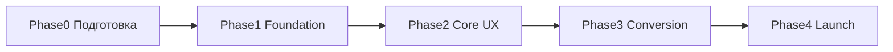

# План реализации сайта АО «Электроконтактор»

> **Документ:** пошаговый атомарный план разработки  
> **Основание:** [TZ.md](./TZ.md)  
> **Версия:** 1.0 · 30.06.2026  
> **Оценка MVP:** 14–18 недель (1 fullstack + 1 frontend/design part-time)

---

## Как пользоваться этим планом

1. Выполняйте шаги **строго по порядку** внутри каждой фазы (зависимости указаны).
2. Отмечайте выполненное: `- [x] STEP-XXX`.
3. Каждый шаг считается завершённым по **Definition of Done** из [TZ.md §20](./TZ.md).
4. Блокеры — см. [§ Блокеры и решения заказчика](#блокеры-и-решения-заказчика).

### Легенда приоритетов

| Метка | Значение |
|---|---|
| 🔴 | Блокирует следующие шаги |
| 🟡 | Важно для MVP, но можно параллелить |
| 🟢 | Should / Phase 2 |

---

## Обзор фаз

| Фаза | Шаги | Срок | Результат |
|---|---|---|---|
| Phase 0 | STEP-001 … 010 | 2–3 дня | Репозиторий, доступы, данные |
| Phase 1 | STEP-011 … 045 | 4–5 нед | Backend, модели, admin, импорт каталога |
| Phase 2 | STEP-046 … 075 | 5–6 нед | Frontend: каталог, PDP, поиск, сравнение |
| Phase 3 | STEP-076 … 100 | 3–4 нед | Корзина, email, контент, рассылка |
| Phase 4 | STEP-101 … 120 | 2–3 нед | SEO, безопасность, UAT, prod |

---

## Phase 0 — Подготовка (2–3 дня)

### STEP-001 🔴 Инициализация Git-репозитория
- [x] `git init`, ветки `main` / `develop`
- [x] Добавить `.gitignore`, `README.md`, ссылки на `TZ.md` и `PLAN.md`
- [x] Первый commit: `docs: add TZ and implementation plan`

**DoD:** репозиторий создан, секреты не в git.

---

### STEP-002 🔴 Сбор входных данных от заказчика
- [x] Получить email(ы) для заявок (`ORDER_EMAILS`) — предзаполнено из ekontaktor.ru
- [ ] Получить SMTP-доступ или решение (Yandex 360 / корп. почта)
- [x] Уточнить домен: `ekontaktor.ru` — рекомендация зафиксирована
- [x] Уточнить CRM webhook URL (или отложить на STEP-089) — отложено
- [ ] Запросить архив: фото продукции, DWG, паспорта, сертификаты
- [x] Заполнить таблицу в [TZ.md §18](./TZ.md) + [data/CLIENT_INPUT.md](./data/CLIENT_INPUT.md)

**DoD:** минимум email + домен известны до Phase 3.

---

### STEP-003 🔴 Подготовка исходных данных каталога
- [x] Положить `КАТАЛОГ КОНТАКТОРОВ 2026.pdf` в `data/source/`
- [x] Создать `data/pricelist.csv` из [ekontaktor.ru/pricelist](https://www.ekontaktor.ru/pricelist/)
- [x] Создать `data/categories.yaml` — дерево 7 категорий ([TZ §5.2](./TZ.md))
- [x] Зафиксировать `catalog_extract.txt` как reference → `data/source/catalog_extract.txt`

**DoD:** 3 файла в `data/source/` готовы к импорту.

---

### STEP-004 🟡 Выбор хостинга и домена
- [ ] Зарегистрировать/подтвердить DNS — **ожидает заказчика**
- [x] Выбрать VPS (Selectel / Yandex Cloud, 4 vCPU, 8 GB RAM) — [docs/infrastructure/HOSTING.md](./docs/infrastructure/HOSTING.md)
- [ ] Создать staging-домен (`staging.ekontaktor.ru`) — **ожидает заказчика**

**DoD:** DNS A-record указывает на staging (можно позже prod).

---

### STEP-005 🟡 Дизайн-референсы и UI-kit
- [x] Wireframes: главная, каталог, PDP, корзина, о заводе — [docs/design/wireframes/](./docs/design/wireframes/)
- [x] Зафиксировать палитру ([TZ §11.1](./TZ.md)): `#0A1628`, `#0066CC`, `#F59E0B` → [design/tokens.css](./design/tokens.css)
- [x] Подобрать шрифты: Inter / Manrope / JetBrains Mono — [docs/design/DESIGN_SYSTEM.md](./docs/design/DESIGN_SYSTEM.md)

**DoD:** wireframes или Figma для 5 ключевых экранов.

---

## Phase 1 — Foundation: Backend + Infra (4–5 нед)

### Блок 1.1 — Инфраструктура

#### STEP-011 🔴 Docker Compose (dev)
- [ ] `docker-compose.yml`: `db`, `redis`, `backend`, `celery`, `celery-beat`, `frontend`, `nginx`, `minio`, `mailhog`
- [ ] `docker/backend/Dockerfile`, `docker/frontend/Dockerfile`
- [ ] `nginx/nginx.conf` — proxy `/api` → backend, `/` → frontend
- [ ] `.env` из `.env.example`

**DoD:** `docker compose up` поднимает все сервисы без ошибок.

**Файлы:** `docker-compose.yml`, `docker/`, `nginx/`

---

#### STEP-012 🔴 Django project scaffold
- [ ] `django-admin startproject config backend/`
- [ ] `backend/config/settings/` — split: `base.py`, `dev.py`, `prod.py`
- [ ] Подключить PostgreSQL через `DATABASE_URL`
- [ ] Подключить Redis для cache + sessions
- [ ] `manage.py`, `requirements/base.txt`, `requirements/dev.txt`

**DoD:** `python manage.py migrate` успешен в Docker.

---

#### STEP-013 🔴 Next.js 15 scaffold
- [ ] `npx create-next-app@latest frontend --typescript --tailwind --app --src-dir`
- [ ] Настроить `NEXT_PUBLIC_API_URL`
- [ ] Базовый layout: header placeholder, footer placeholder
- [ ] Proxy rewrites в `next.config.ts` для dev API

**DoD:** `npm run dev` — главная открывается на `:3000`.

---

#### STEP-014 🔴 CI pipeline (базовый)
- [ ] `.github/workflows/ci.yml`: lint backend (ruff), lint frontend (eslint), pytest, build Docker
- [ ] Pre-commit hooks (optional): ruff, eslint

**DoD:** push в `develop` запускает CI green.

---

### Блок 1.2 — Django Apps и модели

#### STEP-015 🔴 App `products`
- [ ] Создать `backend/apps/products/`
- [ ] Модели: `Category` (MPTT), `ProductGroup`, `ProductVariant`, `ProductSpec`, `ProductImage`
- [ ] Индексы: `nominal_current_a`, `category_id`, `is_active`
- [ ] Migrations

**DoD:** модели в admin (raw) отображаются. **TZ:** §6.1

---

#### STEP-016 🔴 App `docs`
- [ ] Модели: `Document`, `ProductDocument` (M2M link)
- [ ] Upload path: `media/docs/{uuid}.{ext}`
- [ ] MIME validation (pdf, dwg, jpg, png), max 20 MB

**DoD:** upload PDF в admin работает. **TZ:** §6.2, FR-SEC-06

---

#### STEP-017 🔴 App `quotes`
- [ ] Модели: `QuoteCart`, `QuoteCartItem`, `QuoteRequest`, `QuoteRequestItem`
- [ ] Auto-number: `ЗК-{YYYY}-{NNNNN}`
- [ ] Status workflow: new → in_progress → quoted → completed / cancelled

**DoD:** unit-test генерации номера заявки. **TZ:** §6.3

---

#### STEP-018 🔴 App `content`
- [ ] Модели: `Page`, `NewsPost`, `FAQItem`, `SiteSettings` (singleton)
- [ ] `SiteSettings`: phones, emails, address, order_emails[], webhook_url

**DoD:** SiteSettings editable в admin. **TZ:** §6.5

---

#### STEP-019 🔴 App `newsletter`
- [ ] Модели: `NewsletterSubscriber`, `NewsletterCampaign`, `NewsletterSendLog`
- [ ] Tokens: confirm_token, unsubscribe_token (uuid)

**DoD:** migrations applied. **TZ:** §6.4

---

#### STEP-020 🔴 App `leads`
- [ ] Модели: `ContactLead`, `CallbackLead`, `DocumentRequestLead`

**DoD:** migrations applied. **TZ:** §7.8

---

#### STEP-021 🔴 App `seo`
- [ ] Модели: `Redirect` (old_path → new_path, 301), `SearchQueryLog`

**DoD:** migrations applied. **TZ:** §6.5, FR-SRH-05

---

#### STEP-022 🔴 App `users`
- [ ] Custom User (optional) или стандартный + Groups
- [ ] Роли: SuperAdmin, ContentManager, SalesManager, ReadOnly (Django Groups)

**DoD:** 4 группы созданы management command. **TZ:** FR-ADM-05

---

### Блок 1.3 — Admin CMS

#### STEP-023 🔴 Django Admin кастомизация
- [ ] Установить `django-unfold` или `django-admin-interface`
- [ ] Admin URL = `manage/` (не `/admin/`) — env `ADMIN_URL`
- [ ] Inline: variants в ProductGroup, specs, images, documents
- [ ] MPTT drag-n-drop для Category (django-mptt-admin)

**DoD:** менеджер может создать товар с 3 вариантами за 5 мин. **TZ:** §8.2

---

#### STEP-024 🔴 django-import-export
- [ ] Resource classes: ProductGroup, ProductVariant, Category
- [ ] Шаблон Excel: `data/templates/import_products.xlsx`
- [ ] Admin action: Export / Import

**DoD:** export → edit → import roundtrip без потери данных. **TZ:** §8.2

---

#### STEP-025 🔴 Безопасность admin (Phase 1 baseline)
- [ ] `django-axes`: 5 попыток / 30 мин lockout
- [ ] `django-otp` + TOTP для superuser
- [ ] `django-auditlog` на ProductGroup, ProductVariant, QuoteRequest, SiteSettings

**DoD:** после 5 неверных паролей — блокировка. **TZ:** FR-ADM-02…04

---

### Блок 1.4 — REST API (backend core)

#### STEP-026 🔴 DRF setup
- [ ] `djangorestframework`, `django-filter`, `drf-spectacular`
- [ ] `/api/v1/` router, OpenAPI `/api/schema/`, Swagger UI
- [ ] Pagination: PageNumber, page_size=24
- [ ] CORS whitelist frontend URL

**DoD:** Swagger UI открывается, schema генерируется.

---

#### STEP-027 🔴 API: Categories
- [ ] `GET /api/v1/categories/` — дерево MPTT (cached Redis 1h)
- [ ] Serializer с `children`, `product_count`

**DoD:** Postman/curl возвращает 7 root categories.

---

#### STEP-028 🔴 API: Products list + filters
- [ ] `GET /api/v1/products/` — list ProductGroup
- [ ] Filters: `current`, `coil_voltage`, `poles`, `execution`, `product_type`, `category`
- [ ] Sort: name, price_min, current
- [ ] `select_related` / `prefetch_related`
- [ ] Annotate `price_from` = min variant price

**DoD:** `?current=400&execution=B` возвращает корректный набор. **TZ:** FR-CAT-03…05

---

#### STEP-029 🔴 API: Product detail
- [ ] `GET /api/v1/products/{slug}/` — group + variants + specs + images + docs
- [ ] `GET /api/v1/variants/{slug}/` — single SKU

**DoD:** PDP API содержит все поля для конфигуратора. **TZ:** FR-PDP-01…03

---

#### STEP-030 🟡 API: Compare
- [ ] `GET /api/v1/compare/?ids=1,2,3,4` — max 4 variants, side-by-side specs

**DoD:** 4 SKU возвращают unified spec table. **TZ:** FR-CMP-01…02

---

### Блок 1.5 — Импорт каталога

#### STEP-031 🔴 Management command: import categories
- [ ] `python manage.py import_categories data/categories.yaml`
- [ ] Создать 7 категорий + подкатегории (серии 6012–6053, 6600, 7200…)

**DoD:** дерево категорий в admin совпадает с TZ §5.2.

---

#### STEP-032 🔴 Parser: PDF catalog → ProductGroup
- [ ] `scripts/parse_catalog_pdf.py` — извлечь: модель, назначение, specs
- [ ] Группировка: КТ6012Б-У3 + КТ6012БС-У3 → одна ProductGroup «КТ 6012 100А»
- [ ] `python manage.py import_catalog_pdf data/source/КАТАЛОГ*.pdf`

**DoD:** 81 модель → ~40 ProductGroup с specs. **TZ:** §8.3

---

#### STEP-033 🔴 Import pricelist → ProductVariant
- [ ] `python manage.py import_pricelist data/pricelist.csv`
- [ ] Match SKU → variant, set price, execution, coil_voltage
- [ ] Fallback: создать variant если нет в PDF (выключатели, КЭ, ПВП)

**DoD:** все позиции прайса ekontaktor.ru имеют price > 0.

---

#### STEP-034 🟡 Placeholder images + documents
- [ ] Default image: `frontend/public/placeholder-product.svg`
- [ ] Management command: assign placeholder to groups without image
- [ ] Seed: 5–10 реальных паспортов PDF (если есть от заказчика)

**DoD:** ни одна карточка не показывает broken image.

---

#### STEP-035 🔴 PostgreSQL full-text search setup
- [ ] Enable extension `pg_trgm`
- [ ] SearchVector на ProductGroup (name, series_code) + ProductVariant (sku_code)
- [ ] GIN indexes
- [ ] `python manage.py rebuild_search_index`

**DoD:** search «кт6043» находит КТ6043. **TZ:** FR-SRH-02

---

#### STEP-036 🔴 Celery setup
- [ ] `config/celery.py`, worker + beat в Docker
- [ ] Test task: `debug_task` ping
- [ ] Redis broker

**DoD:** celery worker logs «ready».

---

#### STEP-037 🟡 Seed content (dev)
- [ ] Fixture: SiteSettings (phones, address из ekontaktor.ru)
- [ ] 3 NewsPost, 5 FAQItem, Page «about», «contacts», «privacy», «terms»
- [ ] `python manage.py loaddata seed_content.json`

**DoD:** API `/api/v1/pages/about/` возвращает контент.

---

### ✅ Checkpoint Phase 1

| Критерий | Проверка |
|---|---|
| Docker up | `docker compose ps` — all healthy |
| Catalog in DB | ≥ 80% SKU из прайса |
| Admin works | CRUD товара через `/manage/` |
| API works | Swagger + 3 curl-теста |
| Tests | pytest ≥ 20 tests green |

---

## Phase 2 — Core UX: Frontend (5–6 нед)

### Блок 2.1 — Design System

#### STEP-046 🔴 Tailwind + shadcn/ui setup
- [ ] `npx shadcn@latest init`
- [ ] Компоненты: Button, Input, Select, Badge, Card, Sheet, Tabs, Table, Dialog
- [ ] CSS variables: colors from TZ §11.1
- [ ] Font: Inter via `next/font`

**DoD:** Storybook или `/dev/ui` page с компонентами.

---

#### STEP-047 🔴 Layout components
- [ ] `Header`: logo, nav, search, cart badge, phone CTA
- [ ] `Footer`: links, subscribe form, requisites snippet
- [ ] `Breadcrumbs`
- [ ] `MobileNav` (Sheet)
- [ ] Skip-to-content link (a11y)

**DoD:** layout на всех страницах. **TZ:** §11.3

---

### Блок 2.2 — Главная страница

#### STEP-048 🔴 Homepage `/`
- [ ] Hero: «Производитель контакторов с 1956 года» + CTA «Подобрать контактор»
- [ ] Блок серий (КТ 6000, 6600, КТП, КТЭ)
- [ ] Trust badges: Честный знак, 100% РФ, EAC
- [ ] Хиты продаж (API: featured products)
- [ ] Последние новости (3 шт.)
- [ ] Subscribe form (stub → Phase 3)
- [ ] SSR, meta tags

**DoD:** Lighthouse SEO ≥ 90 на главной (local). **TZ:** §11.2

---

### Блок 2.3 — Каталог

#### STEP-049 🔴 Catalog root `/catalog/`
- [ ] Category grid с иконками/фото
- [ ] SSR fetch categories

**DoD:** 7 категорий отображаются.

---

#### STEP-050 🔴 Category page `/catalog/[...slug]/`
- [ ] Product grid (12/24/48 per page)
- [ ] Grid/List toggle
- [ ] Sidebar filters (desktop): current, coil, poles, execution, type
- [ ] Bottom Sheet filters (mobile)
- [ ] URL sync: `?current=400&coil=220&page=2`
- [ ] Sort dropdown
- [ ] Skeleton loading, lazy images
- [ ] Empty state + «Сбросить фильтры»
- [ ] noindex meta when filters active

**DoD:** все FR-CAT-01…08. Протестировать на 375px и 1280px.

---

#### STEP-051 🔴 ProductCard component
- [ ] Image, name, current, price «от X ₽», badge «Производитель»
- [ ] Buttons: «Подробнее», «В заявку» (quick add default variant)
- [ ] Clickable entire card → PDP

**DoD:** карточка соответствует FR-CAT-06.

---

### Блок 2.4 — Карточка товара (PDP)

#### STEP-052 🔴 PDP page `/catalog/[cat]/[product]/`
- [ ] SSR fetch ProductGroup
- [ ] Gallery (primary image + thumbs)
- [ ] **Configurator**: execution chips, coil voltage select, aux contacts
- [ ] On variant change: update price, SKU, URL (`?variant=slug`)
- [ ] Quantity stepper 1–9999
- [ ] CTA: «Добавить в заявку», «Сравнить», «Скачать паспорт»
- [ ] Sticky mobile bar: price + CTA

**DoD:** FR-PDP-01…03, 11…13.

---

#### STEP-053 🔴 PDP tabs
- [ ] Tab «Характеристики» — table + specs
- [ ] Tab «Документация» — PDF/DWG download links
- [ ] Tab «Описание» — назначение HTML
- [ ] Block «Структура условного обозначения» (interactive)
- [ ] Badge «Честный знак» + tooltip

**DoD:** FR-PDP-04…09.

---

#### STEP-054 🟡 PDP related blocks
- [ ] «Похожие товары» carousel
- [ ] «Аксессуары» (катушки, блокировки)
- [ ] FAQ accordion (3–5 вопросов по модели)

**DoD:** FR-PDP-10, FR-SEO-09.

---

#### STEP-055 🔴 Schema.org JSON-LD
- [ ] Product + Offer + BreadcrumbList on PDP
- [ ] Organization on homepage
- [ ] Validate: Google Rich Results Test

**DoD:** FR-PDP-14, FR-SEO-06.

---

### Блок 2.5 — Поиск и сравнение

#### STEP-056 🔴 Search autocomplete
- [ ] Header search input → debounced API `/api/v1/search/suggest?q=`
- [ ] Dropdown: SKU, name, category
- [ ] Response < 200ms (cached)

**DoD:** FR-SRH-01, FR-SRH-04.

---

#### STEP-057 🔴 Search results `/search/`
- [ ] Full results page + filters + pagination
- [ ] Highlight matched terms

**DoD:** FR-SRH-03.

---

#### STEP-058 🔴 Compare page `/compare/`
- [ ] localStorage `compare_ids[]` max 4
- [ ] Fetch `/api/v1/compare/?ids=`
- [ ] Side-by-side table, highlight diffs
- [ ] «Добавить все в заявку» button
- [ ] Header compare badge count

**DoD:** FR-CMP-01…04.

---

### Блок 2.6 — API client layer

#### STEP-059 🔴 Frontend API module
- [ ] `lib/api/client.ts` — fetch wrapper, error handling
- [ ] `lib/api/products.ts`, `categories.ts`, `search.ts`
- [ ] TypeScript types from OpenAPI (optional: `openapi-typescript`)

**DoD:** all pages use typed API client, no raw fetch in components.

---

### ✅ Checkpoint Phase 2

| Критерий | Проверка |
|---|---|
| Catalog filters | 5 filter combinations manual test |
| PDP configurator | Switch variant → price changes |
| Search | «кт6043» finds product |
| Compare | 4 products side-by-side |
| Mobile | 375px — catalog + PDP usable |
| Lighthouse | Performance + SEO ≥ 85 (local) |

---

## Phase 3 — Conversion (3–4 нед)

### Блок 3.1 — Корзина-заявка

#### STEP-076 🔴 Cart backend API
- [ ] Session cart via cookie `cart_session` + Redis backup
- [ ] `POST /api/v1/cart/items/` — add (variant_id, quantity)
- [ ] `GET /api/v1/cart/` — list + subtotal
- [ ] `PATCH /api/v1/cart/items/{id}/` — update qty
- [ ] `DELETE /api/v1/cart/items/{id}/`
- [ ] `DELETE /api/v1/cart/clear/`
- [ ] Price snapshot on add

**DoD:** FR-CART-01, cart persists 30 days.

---

#### STEP-077 🔴 Cart frontend
- [ ] Mini-cart in header (count + sum)
- [ ] `/cart/` page: table, edit qty, remove, clear
- [ ] Real-time subtotal recalc
- [ ] Empty cart state

**DoD:** FR-CART-02…05.

---

#### STEP-078 🔴 Quote submit API
- [ ] `POST /api/v1/quotes/` — validate form, create QuoteRequest + items
- [ ] Honeypot field `website` (hidden)
- [ ] Rate limit: 5/IP/hour (django-ratelimit)
- [ ] Return `{ number: "ЗК-2026-00001" }`

**DoD:** FR-CART-06…10, FR-CART-13.

---

#### STEP-079 🔴 Quote form UI
- [ ] Form: name*, company*, email*, phone*, city, INN, KPP, comment
- [ ] Validation: email, phone +7, INN 10/12 digits
- [ ] Privacy checkbox*
- [ ] Submit → redirect `/order/success?number=...`

**DoD:** FR-CART-06…08.

---

#### STEP-080 🔴 Email: менеджеру
- [ ] Celery task `send_quote_notification(quote_id)`
- [ ] HTML template — table per TZ §7.5.1
- [ ] Recipients from `SiteSettings.order_emails`
- [ ] Mailhog test in dev

**DoD:** FR-CART-11. Email в Mailhog с таблицей и итогом.

---

#### STEP-081 🔴 Email + PDF: клиенту
- [ ] Celery task `send_quote_confirmation(quote_id)`
- [ ] HTML «Ваша заявка принята № ...»
- [ ] PDF КП attachment (WeasyPrint template)
- [ ] PDF: header завода, table, total, disclaimer

**DoD:** FR-CART-12. PDF opens correctly.

---

#### STEP-082 🔴 CRM Webhook
- [ ] Celery task `send_crm_webhook(quote_id)` — POST JSON (TZ §13.1)
- [ ] Retry 3x with exponential backoff
- [ ] Log success/failure in QuoteRequest

**DoD:** FR-CART-14. Webhook visible in logs (mock server).

---

#### STEP-083 🟡 Quote admin workflow
- [ ] Admin: QuoteRequest list, filters by status
- [ ] Actions: mark in_progress, quoted, completed
- [ ] Manager comment field
- [ ] Export CSV

**DoD:** sales manager can process quote in admin.

---

#### STEP-084 🟢 PDF preview + Excel export
- [ ] `GET /api/v1/cart/export/pdf/` — preview before submit
- [ ] `GET /api/v1/cart/export/xlsx/`

**DoD:** FR-CART-15…16.

---

### Блок 3.2 — Лиды

#### STEP-085 🔴 Contact + Callback forms
- [ ] `POST /api/v1/leads/contact/`, `/api/v1/leads/callback/`
- [ ] UI: modal forms in header/footer
- [ ] Email notification + admin record

**DoD:** FR-LEAD-01…02, FR-LEAD-04.

---

### Блок 3.3 — Контентные страницы

#### STEP-086 🔴 Static pages
- [ ] `/about/` — history since 1956, mission, production
- [ ] `/about/certificates/` — gallery + PDF download
- [ ] `/about/production/`
- [ ] `/contacts/` — phones, emails, requisites, Yandex Map iframe
- [ ] `/support/` — FAQ list + contact form
- [ ] `/dealers/` — partner form
- [ ] `/privacy/`, `/terms/`

**DoD:** FR-CNT-01…03, FR-CNT-05…07.

---

#### STEP-087 🔴 News
- [ ] `/news/` — list with pagination
- [ ] `/news/[slug]/` — article SSR
- [ ] `/news/rss.xml` — RSS feed

**DoD:** FR-CNT-04.

---

#### STEP-088 🟡 Application pages
- [ ] `/applications/crane/`, `/applications/nku/`, `/applications/transport/`
- [ ] Product recommendations per application

**DoD:** FR-CNT-08.

---

#### STEP-089 🔴 Anti-counterfeit block
- [ ] Component on homepage + PDP footer
- [ ] Text from TZ §1.1 + link to contacts

**DoD:** FR-CNT-07.

---

### Блок 3.4 — Рассылка

#### STEP-090 🔴 Newsletter subscribe API
- [ ] `POST /api/v1/newsletter/subscribe/` — email, name
- [ ] Create subscriber status=pending, send confirm email
- [ ] `GET /subscribe/confirm/{token}/` — activate
- [ ] `GET /unsubscribe/{token}/` — deactivate

**DoD:** FR-NL-01…03.

---

#### STEP-091 🔴 Newsletter admin + send
- [ ] Admin: Campaign CRUD (subject, WYSIWYG body)
- [ ] Preview to test email
- [ ] Celery batch send: 100/min throttle
- [ ] SendLog per recipient
- [ ] Unsubscribe link in every email

**DoD:** FR-NL-04…09.

---

#### STEP-092 🔴 Subscribe UI
- [ ] Footer form + `/news/` sidebar
- [ ] Success / «check your email» message

**DoD:** FR-NL-01.

---

### ✅ Checkpoint Phase 3

| Критерий | Проверка |
|---|---|
| Full quote flow | Add 3 items → submit → success page |
| Manager email | HTML table with total |
| Client email | PDF attached |
| Newsletter | Subscribe → confirm → active |
| Content | All static pages render |

---

## Phase 4 — Launch (2–3 нед)

### Блок 4.1 — SEO

#### STEP-101 🔴 Sitemap + robots
- [ ] Celery beat: daily `generate_sitemap` → `/sitemap.xml` (products, categories, news, pages)
- [ ] `robots.txt` — allow /, disallow /manage/, /api/
- [ ] next-sitemap config for frontend static routes

**DoD:** FR-SEO-04…05. sitemap contains all active products.

---

#### STEP-102 🔴 Meta + canonical
- [ ] Every page: unique title, description, h1 from CMS
- [ ] Canonical URLs on PDP (default variant)
- [ ] OG + Twitter Card tags

**DoD:** FR-SEO-02…03, FR-PDP-15.

---

#### STEP-103 🔴 301 Redirects
- [ ] Import old ekontaktor.ru URLs → Redirect model
- [ ] Middleware or nginx rules
- [ ] Management command `import_redirects data/redirects.csv`

**DoD:** FR-SEO-08. Top 20 old URLs redirect correctly.

---

#### STEP-104 🔴 Analytics
- [ ] Yandex.Metrika counter + goal «quote_submit»
- [ ] GA4 + event `generate_lead`
- [ ] UTM capture in QuoteRequest

**DoD:** test goal fires on quote submit.

---

### Блок 4.2 — Security hardening

#### STEP-105 🔴 Production security
- [ ] HTTPS + HSTS (nginx + Let's Encrypt certbot)
- [ ] Secure cookies, CSRF, CSP headers
- [ ] CORS prod whitelist
- [ ] File upload audit
- [ ] `pip-audit`, `npm audit` in CI

**DoD:** FR-SEC-01…12 checklist passed.

---

#### STEP-106 🔴 Rate limiting (nginx + app)
- [ ] nginx: API 100 req/min, forms 5/hour
- [ ] django-ratelimit on quote, leads, subscribe

**DoD:** FR-SEC-07.

---

### Блок 4.3 — Performance

#### STEP-107 🔴 Performance optimization
- [ ] Redis cache tuning (TTLs from TZ §9.2)
- [ ] Next.js Image optimization, WebP
- [ ] DB query audit (django-debug-toolbar → fix N+1)
- [ ] Lighthouse CI in GitHub Actions

**DoD:** Lighthouse Performance + SEO + A11y ≥ 90 on home, catalog, PDP.

---

### Блок 4.4 — Testing

#### STEP-108 🔴 Automated tests
- [ ] Backend: pytest ≥ 50 tests (models, API, quote flow, search)
- [ ] Frontend: vitest component tests (key components)
- [ ] E2E Playwright: `add_to_cart → submit_quote → success`
- [ ] k6 load test: 50 VU browse catalog 5 min

**DoD:** TZ §16.1 test plan items covered.

---

#### STEP-109 🔴 UAT with заказчик
- [ ] UAT checklist 20 пунктов (from TZ §16.2)
- [ ] Fix critical bugs
- [ ] Sign-off document

**DoD:** all §16.2 checkboxes ✅.

---

### Блок 4.5 — Production deploy

#### STEP-110 🔴 Staging deploy
- [ ] Deploy to staging VPS via CI/CD
- [ ] Smoke tests: catalog, PDP, quote, admin
- [ ] Content fill: real photos top-20 SKU

**DoD:** staging URL accessible to заказчик.

---

#### STEP-111 🔴 Production deploy
- [ ] DB backup script (daily cron)
- [ ] Production env vars set (SMTP, ORDER_EMAILS, SECRET_KEY)
- [ ] DNS → production
- [ ] SSL active
- [ ] Monitoring: Sentry DSN

**DoD:** production live, quote email received on real mailbox.

---

#### STEP-112 🟡 Post-launch
- [ ] Submit sitemap to Yandex Webmaster + Google Search Console
- [ ] Monitor 404 logs → add redirects
- [ ] Handover docs: admin guide, import guide
- [ ] Retrospective + Phase 2 backlog (EN, Elasticsearch, 1C, Telegram bot)

**DoD:** site indexed within 7 days.

---

## ✅ Final MVP Checklist (TZ §16.2)

- [ ] Полный каталог из прайса ekontaktor.ru загружен и отображается
- [ ] Фильтры по току, катушке, исполнению работают корректно
- [ ] Конфигуратор вариантов на PDP переключает SKU и цену
- [ ] Корзина сохраняется между сессиями
- [ ] Заявка отправляет email менеджеру с таблицей и итогом
- [ ] Клиент получает PDF-копию спецификации
- [ ] Подписка на рассылку работает (double opt-in)
- [ ] Массовая рассылка из админки отправляется
- [ ] Lighthouse Performance/SEO/Accessibility > 90
- [ ] Schema.org валидируется в Google Rich Results Test
- [ ] sitemap.xml содержит все активные товары
- [ ] Админка защищена 2FA + non-default URL
- [ ] Мобильная версия корзины и каталога функциональна

---

## Блокеры и решения заказчика

| # | Вопрос | Блокирует шаги | Статус |
|---|---|---|---|
| 1 | Email для заявок | STEP-080, STEP-111 | ⏳ Ожидает |
| 2 | Домен | STEP-004, STEP-111 | ⏳ TBD |
| 3 | CRM webhook | STEP-082 | ⏳ TBD |
| 4 | SMTP | STEP-080, STEP-091 | ⏳ TBD |
| 5 | Фото/DWG архив | STEP-034, STEP-110 | ⏳ TBD |
| 6 | Privacy/Terms тексты | STEP-086 | ⏳ Шаблон |
| 7 | EN версия | — | Phase 2 |

---

## Phase 2 Backlog (после MVP)

| ID | Feature | TZ ref |
|---|---|---|
| BL-01 | English version + hreflang | FR-SEO-07 |
| BL-02 | Elasticsearch search | §4.1 |
| BL-03 | 1C / ERP price & stock sync | §13 |
| BL-04 | Telegram bot for new quotes | §13 |
| BL-05 | Customer portal (order history) | — |
| BL-06 | 3D/STEP CAD downloads | FR-PDP-05 |
| BL-07 | Parametric 3D configurator | §11 |

---

## Трекинг прогресса

| Фаза | Всего шагов | Выполнено | % |
|---|---|---|---|
| Phase 0 | 5 | 4* | 80% |
| Phase 1 | 27 | 0 | 0% |
| Phase 2 | 14 | 0 | 0% |
| Phase 3 | 17 | 0 | 0% |
| Phase 4 | 12 | 0 | 0% |
| **Итого** | **75** | **4** | **5%** |

> *Phase 0: STEP-002, STEP-004 частично — ожидают данные от заказчика (SMTP, DNS, медиаархив).

> Обновляйте таблицу по мере выполнения шагов.

---

## Связанные документы

| Файл | Назначение |
|---|---|
| [TZ.md](./TZ.md) | Полное техническое задание |
| [PLAN.md](./PLAN.md) | Данный план (вы здесь) |
| `.env.example` | Переменные окружения |
| `data/source/` | Исходники для импорта |

---

*Следующий шаг: выполнить **STEP-001** — инициализация Git-репозитория.*
