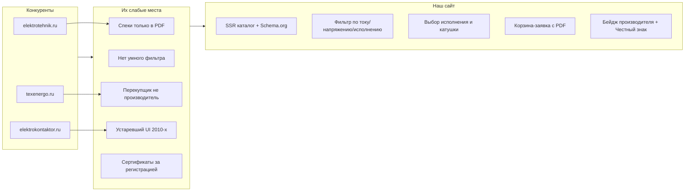
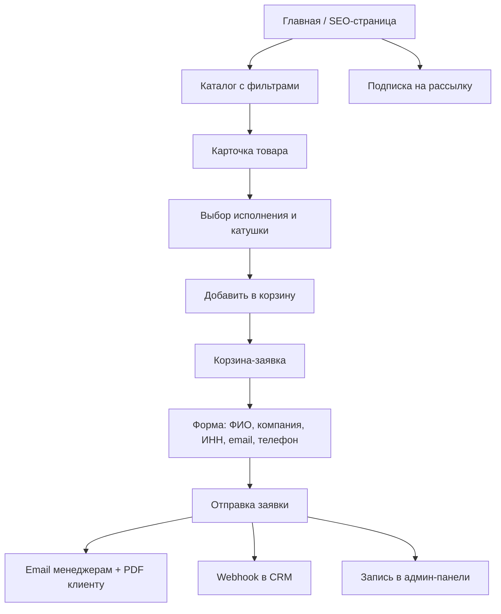
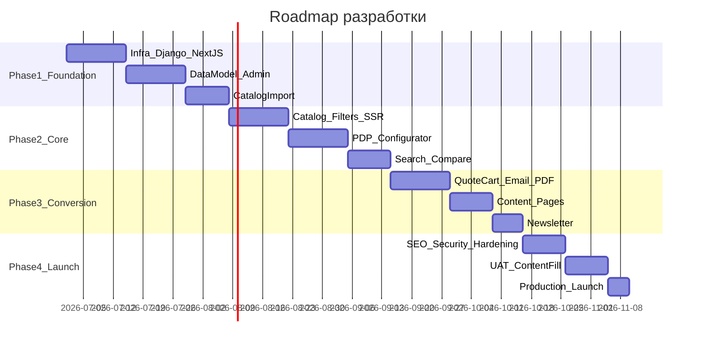

# Техническое задание: сайт АО «Владикавказский завод «Электроконтактор»»

## 1. Общие сведения

| Параметр | Значение |
|---|---|
| Заказчик | АО «Владикавказский завод «Электроконтактор» |
| Юр. адрес | 362003, РСО-Алания, г. Владикавказ, ул. Кабардинская, 8 |
| Официальный сайт (текущий) | [ekontaktor.ru](https://www.ekontaktor.ru/) — устарел (дизайн ~2005, нет каталога, нет корзины) |
| Конкурирующие площадки | [elektrotehnik.ru](https://www.elektrotehnik.ru/) (дистрибьютор, PDF-каталоги), [texenergo.ru](https://www.texenergo.ru/) (маркетплейс, перепродажа КТ/КТП под своим брендом), [elektrokontaktor.ru](https://www.elektrokontaktor.ru/) (ресeller, базовая корзина) |
| Исходные материалы | [КАТАЛОГ КОНТАКТОРОВ 2026.pdf](КАТАЛОГ%20КОНТАКТОРОВ%202026.pdf) (48 стр., 81 модель КТ/КТП), прайс-лист [ekontaktor.ru/pricelist](https://www.ekontaktor.ru/pricelist/) |
| Цель | Сайт-производитель, превосходящий конкурентов по UX, SEO и конверсии в заявку; не визитка, а рабочий инструмент инженера и закупщика |
| MVP-объём каталога | **Полный каталог завода** (контакторы, выключатели, кулачковые элементы, пакетные переключатели, аксессуары) |
| Политика цен | **Публичные цены** из прайса; корзина считает итоговую сумму |

### 1.1 Ключевое конкурентное преимущество (УТП на сайте)

- Прямой производитель с 1956 года (не перекупщик)
- Маркировка «Честный знак» на контакторах
- 100% российские комплектующие, медные контакты
- Структура условного обозначения, чертежи, паспорта — на странице, не только в PDF
- Блок «Остерегайтесь контрафакта» — доверие и SEO по брендовым запросам

---

## 2. Анализ конкурентов и выводы для ТЗ



| Критерий | elektrotehnik | texenergo | elektrokontaktor | **Наш сайт (цель)** |
|---|---|---|---|---|
| Фильтр по параметрам | Нет | Частичный | Нет | Полный faceted search |
| Выбор исполнения (Б/БС, катушка) | Нет | Нет | Таблица вариантов | Интерактивный конфигуратор |
| Сравнение моделей | Нет | Есть | Нет | Side-by-side до 4 SKU |
| Документация на странице | PDF-скачивание | За регистрацией | Частично | Открытые паспорта/чертежи |
| SEO / Core Web Vitals | Слабо | Средне | Слабо | Lighthouse > 90 |
| Корзина B2B | Есть | E-commerce | Базовая | Корзина-заявка + email-отчёт |
| Производитель vs ресeller | Дистрибьютор | Перекупщик | Неясно | Явный акцент «завод» |

---

## 3. Целевая аудитория и сценарии

### 3.1 Персоны

| Персона | Задача | Критичный функционал |
|---|---|---|
| Инженер-конструктор | Подобрать контактор по току, полюсам, катушке | Фильтры, сравнение, чертежи, структура обозначения |
| Закупщик / снабженец | Сформировать спецификацию и отправить КП | Корзина, количество, итог, экспорт PDF/Excel |
| Техдиректор / ЛПР | Оценить производителя | О заводе, сертификаты, новости, контакты |
| Дилер | Заказ партии, актуальный прайс | Каталог, цены, быстрая заявка |
| Маркетолог завода | Управление контентом | CMS, рассылка, SEO-поля |

### 3.2 Основные user flow



---

## 4. Технологический стек

### 4.1 Рекомендуемый стек (финальный)

| Слой | Технология | Обоснование |
|---|---|---|
| Backend | **Python 3.12+, Django 5.x, DRF 3.15+** | CMS, ORM, admin, безопасность из коробки |
| Frontend | **Next.js 15 (App Router), React 18+, TypeScript** | SSR/SSG для SEO, производительность |
| UI | **Tailwind CSS 4 + shadcn/ui** | Современный B2B-дизайн, доступность |
| БД | **PostgreSQL 16+** | JSONB для specs, full-text search, trigram |
| Кэш / сессии | **Redis 7+** | Кэш каталога, корзина гостя, Celery broker |
| Очереди | **Celery 5 + Celery Beat** | Email, рассылки, генерация PDF, sitemap |
| Поиск | **PostgreSQL SearchVector + pg_trgm** | MVP; интерфейс для Elasticsearch на Phase 2 |
| Файлы | **S3-совместимое хранилище** (MinIO локально, S3/Yandex Object Storage prod) | PDF, DWG, изображения |
| Email | **SMTP** (корпоративная почта) + **django-anymail** | Заявки, рассылка, double opt-in |
| PDF | **WeasyPrint** или **reportlab** | Коммерческое предложение из корзины |
| Reverse proxy | **Nginx** | SSL, статика, rate limit |
| App server | **Gunicorn + Uvicorn (ASGI)** | HTTP + future WebSocket |
| Контейнеризация | **Docker + Docker Compose** | Dev/stage/prod parity |
| Мониторинг | **Sentry** (ошибки), **Prometheus + Grafana** (опционально Phase 2) | Production observability |
| CI/CD | **GitHub Actions** | Lint, test, deploy |
| Аналитика | **Яндекс.Метрика + Google Analytics 4** | Воронка, цели «заявка» |
| SEO | **next-sitemap**, JSON-LD, **robots.txt** | Индексация |

### 4.2 Python-зависимости (ключевые)

```
django, djangorestframework, django-cors-headers, django-filter
django-import-export, django-axes, django-otp, django-auditlog
psycopg2-binary, redis, celery, django-celery-beat
pillow, python-magic (MIME validation), weasyprint
djangorestframework-simplejwt (admin API), bleach (HTML sanitize)
django-storages, boto3
```

### 4.3 Структура монорепозитория

```
cehsite/
├── backend/                 # Django project
│   ├── config/              # settings, urls, wsgi/asgi
│   ├── apps/
│   │   ├── products/        # каталог, категории, варианты
│   │   ├── docs/            # документы, чертежи, сертификаты
│   │   ├── quotes/          # корзина, заявки, PDF
│   │   ├── leads/           # обратная связь, callback
│   │   ├── content/         # страницы, новости, блоки
│   │   ├── newsletter/      # подписка, кампании
│   │   ├── users/           # staff, roles, audit
│   │   └── seo/             # sitemap, redirects, meta
│   └── requirements/
├── frontend/                # Next.js 15
│   ├── app/                 # App Router pages
│   ├── components/
│   ├── lib/api/
│   └── public/
├── docker/
├── nginx/
├── scripts/                 # import from Excel/CSV, catalog migration
└── docs/
    └── TZ.md                # данное ТЗ (артефакт)
```

---

## 5. Информационная архитектура сайта

### 5.1 Дерево разделов (sitemap)

```
/                                    — Главная
/catalog/                            — Корень каталога
/catalog/{category-slug}/            — Категория (вложенная)
/catalog/{category-slug}/{product-slug}/ — Карточка товара (группа)
/product/{sku-slug}/                 — Конкретный SKU (вариант) — canonical
/compare/                            — Сравнение (до 4 позиций)
/cart/                               — Корзина-заявка
/order/success/                      — Подтверждение заявки
/search/                             — Результаты поиска
/applications/                       — Применение (краны, НКУ, АВР, метро...)
/about/                              — О заводе
/about/history/                      — История с 1956
/about/certificates/                 — Сертификаты завода
/about/production/                   — Производство
/dealers/                            — Дилерам
/support/                            — Техподдержка, FAQ
/contacts/                           — Контакты, реквизиты, карта
/news/                               — Новости
/news/{slug}/                        — Статья
/documents/                          — Общие документы (каталоги PDF)
/privacy/                            — Политика конфиденциальности
/terms/                              — Пользовательское соглашение
/subscribe/confirm/{token}/          — Подтверждение рассылки
/unsubscribe/{token}/                — Отписка
```

### 5.2 Категории каталога (уровень 1)

1. **Контакторы электромагнитные переменного тока (КТ)**
   - Серия КТ 6000Б (Б/БС): 6012–6053
   - Серия КТ 6600 (С): 6612–6663
   - Серия КТ 7200У: 7223
2. **Контакторы постоянного тока (КТП)**
   - Зеркальные серии к КТ
3. **Контакторы для электротранспорта (КТЭ)**
   - КТЭ 01-25, КТЭ 02-160, КТЭ 02-250 (варианты с/без БВК)
4. **Аксессуары к контакторам**
   - Катушки, мехблокировки, гибкие соединения, блок-контакты
5. **Выключатели**
   - ВПК 3110, ВУ22Т и др.
6. **Кулачковые элементы**
   - КЭ-42, КЭ-46, КЭ-47, ЭУ-1, ЭУ-5 и др.
7. **Пакетные переключатели**
   - ПВП 17-29, ПВП 17-31

> Категории — **MPTT** (django-mptt), неограниченная вложенность.

---

## 6. Модель данных (детально)

### 6.1 Продуктовая иерархия: Group → Variant (SKU)

Ключевое решение: **не 81 отдельная карточка**, а **группы продуктов с вариантами**.

```python
# products/models.py — концептуальная схema

class Category(MPTTModel):
    name, slug, parent, description, image
    meta_title, meta_description, h1
    sort_order, is_active
    # SEO: canonical override, noindex flag

class ProductGroup(models.Model):
    """Страница каталога: 'Контактор КТ 6043 400А'"""
    category = FK(Category)
    name, slug, short_description, full_description  # HTML (sanitized)
    series_code          # "6043"
    product_type         # KT | KTP | KTE | ACCESSORY | SWITCH | ...
    nominal_current_a    # 400 (indexed)
    nominal_voltage_v    # 380
    poles                # 2|3|4
    application_category # AC-3, AC-4
    designation_structure # HTML блок структуры обозначения
    honest_sign          # bool — Честный знак
    meta_title, meta_description, h1
    is_active, sort_order
    related_groups       # M2M self — похожие, аксессуары

class ProductVariant(models.Model):
    """Конкретный SKU: 'КТ6043Б-У3 400А катушка 220В'"""
    group = FK(ProductGroup, related_name='variants')
    sku_code             # "КТ6043Б-У3" unique
    slug                 # unique URL
    execution            # B | BS | S | ...
    coil_type            # AC | DC
    coil_voltage_v       # 220, 380, ...
    aux_contacts         # "2NO+2NC" | "3NO+3NC"
    price                # Decimal, руб. с НДС
    price_valid_from     # date
    weight_net_kg, weight_gross_kg
    dimensions           # JSON {L, A, B, B1, R}
    stock_status         # in_stock | on_order | discontinued
    is_default           # default variant for group page
    is_active

class ProductSpec(models.Model):
    """Нормализованные характеристики для фильтрации"""
    group = FK(ProductGroup)
    spec_key   # slug: nominal_current, coil_voltage, ...
    spec_value # "400", "220"
    spec_unit  # "А", "В"
    filterable # bool — участвует в faceted filter

class ProductImage(models.Model):
    group, image, alt, sort_order, is_primary

class ProductDocument(models.Model):
    group | variant (nullable), document FK
```

### 6.2 Документы

```python
class Document(models.Model):
    name, file, mime_type, file_size
    doc_type  # passport | certificate | drawing_dwg | drawing_pdf | catalog | tu
    language  # ru
    is_public # сертификаты завода — public; некоторые — по запросу
    uploaded_at, uuid_filename
```

### 6.3 Корзина и заявки

```python
class QuoteCart(models.Model):
    session_key | user (nullable)
    created_at, updated_at, expires_at  # TTL 30 дней

class QuoteCartItem(models.Model):
    cart, variant FK, quantity (min 1, max 9999)
    unit_price_snapshot  # фиксация цены на момент добавления
    coil_voltage_snapshot  # если выбрано на UI

class QuoteRequest(models.Model):
    number          # ЗК-2026-00001 auto
    status          # new | in_progress | quoted | completed | cancelled
    # Клиент
    contact_name, company_name, inn (optional), kpp (optional)
    email, phone, city, comment
    # Суммы
    subtotal, vat_included=True
    # Meta
    ip, user_agent, utm_source/medium/campaign
    created_at, processed_at, assigned_manager FK

class QuoteRequestItem(models.Model):
    request, sku_code, product_name, unit_price, quantity, line_total
```

### 6.4 Рассылка

```python
class NewsletterSubscriber(models.Model):
    email (unique), name, company
    status       # pending | active | unsubscribed
    confirm_token, unsubscribe_token
    subscribed_at, confirmed_at, source

class NewsletterCampaign(models.Model):
    subject, body_html, body_text
    status       # draft | scheduled | sending | sent
    scheduled_at, sent_at
    sent_count, open_count (optional pixel)
    created_by FK
```

### 6.5 Контент и SEO

```python
class Page          # статические страницы (about, dealers...)
class NewsPost      # slug, title, body, published_at, meta_*
class FAQItem       # category, question, answer — для AEO
class Redirect      # old_url → new_url (301)
class SiteSettings  # singleton: phones, emails, address, social, counterparty
```

---

## 7. Функциональные требования (атомарно)

### 7.1 Модуль «Каталог» (FR-CAT)

| ID | Требование | Приоритет |
|---|---|---|
| FR-CAT-01 | Многоуровневое дерево категорий с хлебными крошками | Must |
| FR-CAT-02 | Список товаров: grid/list toggle, 12/24/48 на страницу | Must |
| FR-CAT-03 | Faceted-фильтры: номинальный ток, напряжение катушки, полюса, исполнение (Б/БС/С), тип (КТ/КТП), категория применения | Must |
| FR-CAT-04 | Фильтры работают через URL query (`?current=400&coil=220`) — шaring и SEO-safe (noindex для filtered) | Must |
| FR-CAT-05 | Сортировка: по названию, по цене, по току | Must |
| FR-CAT-06 | Карточка в списке: фото, название, ток, цена «от X ₽», бейдж «Производитель», кнопки «Подробнее» / «В заявку» | Must |
| FR-CAT-07 | Lazy-load изображений, skeleton UI | Must |
| FR-CAT-08 | Пустое состояние фильтра с предложением сбросить | Should |

### 7.2 Модуль «Карточка товара» (FR-PDP)

| ID | Требование | Приоритет |
|---|---|---|
| FR-PDP-01 | SSR-страница ProductGroup с canonical на default variant | Must |
| FR-PDP-02 | **Конфигуратор вариантов**: исполнение (Б/БС), напряжение катушки (select/chips), вспомогательные контакты | Must |
| FR-PDP-03 | При смене варианта — обновление цены, артикула, SKU, URL (shallow routing) | Must |
| FR-PDP-04 | Таб «Характеристики» — структурированная таблица + JSON specs | Must |
| FR-PDP-05 | Таб «Документация» — паспорт PDF, чертеж DWG/PDF, сертификат (скачивание) | Must |
| FR-PDP-06 | Блок «Структура условного обозначения» с интерактивной расшифровкой | Must |
| FR-PDP-07 | Габаритный чертёж (изображение + download DWG) | Must |
| FR-PDP-08 | Блок «Назначение» из каталога 2026 | Must |
| FR-PDP-09 | Бейдж «Честный знак» с tooltip | Must |
| FR-PDP-10 | «Похожие товары» и «Аксессуары» (катушки, блокировки) | Must |
| FR-PDP-11 | Кнопки: «Добавить в заявку», «Сравнить», «Скачать паспорт» | Must |
| FR-PDP-12 | Quantity stepper (1–9999) перед добавлением | Must |
| FR-PDP-13 | Sticky bar на mobile: цена + «В заявку» | Must |
| FR-PDP-14 | Schema.org: Product, Offer, BreadcrumbList | Must |
| FR-PDP-15 | Open Graph + Twitter Card для шеринга | Should |

### 7.3 Модуль «Сравнение» (FR-CMP)

| ID | Требование | Приоритет |
|---|---|---|
| FR-CMP-01 | Добавление до 4 SKU в compare (localStorage + server sync) | Must |
| FR-CMP-02 | Таблица side-by-side: все filterable specs | Must |
| FR-CMP-03 | Highlight различий между моделями | Should |
| FR-CMP-04 | «Добавить все в заявку» из сравнения | Should |

### 7.4 Модуль «Поиск» (FR-SRH)

| ID | Требование | Приоритет |
|---|---|---|
| FR-SRH-01 | Глобальный поиск в header: autocomplete по артикулу, названию, серии | Must |
| FR-SRH-02 | PostgreSQL full-text + pg_trgm (опечатки: «кт6043» → «КТ6043») | Must |
| FR-SRH-03 | Страница результатов с фильтрами и пагинацией | Must |
| FR-SRH-04 | Search suggestions API < 200ms (cached) | Must |
| FR-SRH-05 | Логирование поисковых запросов без результатов (для SEO) | Should |

### 7.5 Модуль «Корзина-заявка» (FR-CART) — ключевой

| ID | Требование | Приоритет |
|---|---|---|
| FR-CART-01 | Persistent cart: Redis + cookie session (30 дней) | Must |
| FR-CART-02 | Mini-cart в header: количество позиций, сумма | Must |
| FR-CART-03 | Страница корзины: таблица (фото, артикул, название, цена, кол-во, сумма) | Must |
| FR-CART-04 | Редактирование количества, удаление позиции, очистка корзины | Must |
| FR-CART-05 | Пересчёт итога в реальном времени (subtotal, «с НДС») | Must |
| FR-CART-06 | Форма оформления: ФИО*, компания*, email*, телефон*, город, ИНН, КПП, комментарий | Must |
| FR-CART-07 | Валидация: email, телефон (+7), ИНН (10/12 цифр, optional) | Must |
| FR-CART-08 | Согласие на обработку ПД (checkbox, ссылка на privacy) | Must |
| FR-CART-09 | Honeypot + rate limit (5 заявок/IP/час) | Must |
| FR-CART-10 | После отправки — страница success с номером заявки ЗК-YYYY-NNNNN | Must |
| FR-CART-11 | **Email менеджеру**: HTML-таблица (см. шаблон §7.5.1) | Must |
| FR-CART-12 | **Email клиенту**: подтверждение + PDF-коммерческое предложение | Must |
| FR-CART-13 | Сохранение заявки в БД + статус «Новая» | Must |
| FR-CART-14 | Webhook POST JSON в CRM (URL в env, retry 3x через Celery) | Must |
| FR-CART-15 | Экспорт PDF КП из корзины до отправки (optional preview) | Should |
| FR-CART-16 | Экспорт спецификации в Excel | Should |

#### 7.5.1 Шаблон email-отчёта для менеджера

```
Тема: [Заявка ЗК-2026-00142] Запрос КП — {company_name}

Заявка №: ЗК-2026-00142
Дата: 30.06.2026 14:35 (MSK)

КЛИЕНТ
ФИО:          Иванов И.И.
Компания:     ООО «ЭнергоМаш»
ИНН:          7701234567
Email:        buyer@company.ru
Телефон:      +7 (999) 123-45-67
Город:        Москва

СПЕЦИФИКАЦИЯ
| № | Артикул      | Наименование                    | Цена, ₽ | Кол-во | Сумма, ₽  |
|---|--------------|----------------------------------|---------|--------|-----------|
| 1 | КТ6043Б-У3   | Контактор КТ6043Б-У3 400А 220В  | 25 100  | 2      | 50 200    |
| 2 | КТ6043Б-У3   | Контактор КТ6043Б-У3 400А 380В  | 25 100  | 1      | 25 100    |
|   |              |                                  |         | ИТОГО: | 75 300    |

Цены указаны с НДС. Не являются публичной офертой.

Комментарий клиента: ...
Источник: website / utm_campaign=...
```

> Email получателей — настраивается в SiteSettings (`order_emails[]`). Значение будет предоставлено заказчиком отдельным документом.

### 7.6 Модуль «Рассылка» (FR-NL)

| ID | Требование | Приоритет |
|---|---|---|
| FR-NL-01 | Форма подписки в footer и на странице новостей | Must |
| FR-NL-02 | Double opt-in: письмо с confirm link | Must |
| FR-NL-03 | Страница `/unsubscribe/{token}/` — one-click отписка | Must |
| FR-NL-04 | Админ: список подписчиков, экспорт CSV | Must |
| FR-NL-05 | Админ: создание кампании (subject, WYSIWYG body) | Must |
| FR-NL-06 | Массовая отправка через Celery (batch 100, throttle) | Must |
| FR-NL-07 | Предпросмотр кампании на test-email | Must |
| FR-NL-08 | Лог отправок, статус (sent/failed/bounced) | Must |
| FR-NL-09 | CAN-SPAM compliance: ссылка отписки в каждом письме | Must |

### 7.7 Модуль «Контент» (FR-CNT)

| ID | Требование | Приоритет |
|---|---|---|
| FR-CNT-01 | Страница «О заводе»: история с 1956, миссия, производство | Must |
| FR-CNT-02 | Сертификаты завода (галерея + PDF) | Must |
| FR-CNT-03 | Контакты: телефоны отделов, email, реквизиты, карта (Yandex Maps) | Must |
| FR-CNT-04 | Новости: лента + карточка, RSS feed | Must |
| FR-CNT-05 | FAQ по контакторам (AEO-оптимизация) | Must |
| FR-CNT-06 | Страница «Дилерам» с формой партнёрства | Should |
| FR-CNT-07 | Блок «Остерегайтесь контрафакта» | Must |
| FR-CNT-08 | Страницы применения (крановое, НКУ, электротранспорт) | Should |

### 7.8 Модуль «Лиды» (FR-LEAD)

| ID | Требование | Приоритет |
|---|---|---|
| FR-LEAD-01 | Форма «Задать вопрос» (имя, email, телефон, сообщение) | Must |
| FR-LEAD-02 | Форма «Заказать звонок» | Must |
| FR-LEAD-03 | Форма «Запросить документ» (если doc is_public=False) | Should |
| FR-LEAD-04 | Все формы → email + запись в админ + webhook | Must |

---

## 8. Админ-панель (CMS)

### 8.1 Общие требования

| ID | Требование |
|---|---|
| FR-ADM-01 | URL админки: **нестандартный** (`/manage/` или custom), не `/admin/` |
| FR-ADM-02 | TOTP 2FA для superuser (django-otp) |
| FR-ADM-03 | Brute-force protection (django-axes): lockout 5 попыток / 30 мин |
| FR-ADM-04 | AuditLog всех CRUD операций (django-auditlog) |
| FR-ADM-05 | Роли: SuperAdmin, ContentManager, SalesManager, ReadOnly |
| FR-ADM-06 | Django Admin кастомизация: django-admin-interface или unfold |

### 8.2 Разделы админки

| Раздел | Функции |
|---|---|
| Каталог | CRUD категорий (drag-n-drop tree), групп, вариантов, specs, изображений |
| Импорт/экспорт | Excel/CSV через django-import-export; шаблон импорта |
| Документы | Upload PDF/DWG, привязка к товарам, MIME validation |
| Цены | Массовое обновление прайса, price_valid_from |
| Заявки | Список QuoteRequest, смена статуса, комментарий менеджера, экспорт |
| Подписчики | Список, сегменты, CSV export |
| Рассылки | Создание/отправка кампаний |
| Контент | Страницы, новости, FAQ, баннеры главной |
| SEO | Redirects, meta defaults, sitemap regen |
| Настройки | SiteSettings: emails, phones, webhook URL, SMTP test |

### 8.3 Импорт начальных данных

1. Парсинг [КАТАЛОГ КОНТАКТОРОВ 2026.pdf](КАТАЛОГ%20КОНТАКТОРОВ%202026.pdf) → ProductGroup + specs
2. Парсинг прайса ekontaktor.ru → ProductVariant + price
3. Ручная доработка: изображения, чертежи, документы
4. CLI: `python manage.py import_catalog --source=./data/catalog.xlsx`

---

## 9. SEO и производительность

### 9.1 SEO (FR-SEO)

| ID | Требование | KPI |
|---|---|---|
| FR-SEO-01 | SSR/ISR для каталога и карточек | 100% indexable product pages |
| FR-SEO-02 | Уникальные title/description/h1 из CMS на каждой странице | 0 duplicate meta |
| FR-SEO-03 | ЧПУ: `/catalog/kontaktory-kt/kontaktor-kt-6043-400a/` | — |
| FR-SEO-04 | sitemap.xml (products, categories, news, pages) — auto regen daily | — |
| FR-SEO-05 | robots.txt, canonical tags | — |
| FR-SEO-06 | JSON-LD: Organization, Product, Offer, BreadcrumbList, FAQPage | Rich snippets |
| FR-SEO-07 | hreflang (если Phase 2 — EN версия) | — |
| FR-SEO-08 | 301 redirects со старых URL ekontaktor.ru | 0 broken links |
| FR-SEO-09 | FAQ-блоки на PDP и landing (AEO для AI-поиска) | — |
| FR-SEO-10 | noindex для filtered/paginated faceted URLs | — |
| FR-SEO-11 | Core Web Vitals: LCP < 2.5s, CLS < 0.1, INP < 200ms | Lighthouse > 90 |

### 9.2 Performance

- Redis cache: category tree (TTL 1h), product list (TTL 15m), product detail (TTL 15m)
- CDN для static/media (prod)
- Next.js Image optimization (WebP/AVIF)
- DB indexes: `nominal_current_a`, `coil_voltage_v`, `execution`, `category_id`, GIN on search vector
- `select_related` / `prefetch_related` на все list endpoints
- Pagination: max 48 items/page

---

## 10. Безопасность (FR-SEC)

| ID | Требование |
|---|---|
| FR-SEC-01 | HTTPS only, HSTS, secure cookies |
| FR-SEC-02 | CSRF на всех формах (Django + Next.js token) |
| FR-SEC-03 | CORS whitelist (только frontend domain) |
| FR-SEC-04 | Input validation: DRF serializers + pydantic на frontend |
| FR-SEC-05 | HTML sanitization (bleach) для description fields |
| FR-SEC-06 | File upload: whitelist MIME (pdf, dwg, jpg, png), max 20MB, UUID rename |
| FR-SEC-07 | Rate limiting: django-ratelimit / nginx (API 100 req/min, forms 5/hour) |
| FR-SEC-08 | SQL injection: ORM only, no raw SQL without params |
| FR-SEC-09 | XSS: CSP headers, React auto-escape |
| FR-SEC-10 | Secrets in env vars, never in repo |
| FR-SEC-11 | Regular dependency audit (pip-audit, npm audit in CI) |
| FR-SEC-12 | Personal data: 152-ФЗ compliance, privacy policy, cookie consent |

---

## 11. Дизайн-система 2026

### 11.1 Визуальный язык

- **Стиль**: Industrial Premium — чистый, технический, доверительный; не «магазин скидок»
- **Палитра**: тёмно-синий (#0A1628) + электрический акцент (#0066CC) + белый/серый фон; акцент на оранжевый (#F59E0B) только для CTA «В заявку»
- **Типографика**: Inter / Manrope для UI; monospace для артикулов
- **Иконки**: Lucide React
- **Фото**: реальные фото продукции завода, единый фон студии
- **UI-паттерны 2026**: card-based catalog, sticky configurator, micro-animations, skeleton loading, mobile-first

### 11.2 Ключевые экраны (wireframe-логика)

1. **Главная**: Hero «Производитель контакторов с 1956 года» + CTA «Подобрать контактор» + блок серий + trust badges + хиты + новости + форма подписки
2. **Каталог**: sidebar filters (desktop) / bottom sheet (mobile) + product grid
3. **PDP**: gallery left, configurator right, tabs below, sticky CTA mobile
4. **Корзина**: таблица + sidebar с итогом + form
5. **О заводе**: timeline, цифры, сертификаты, производство

### 11.3 Accessibility

- WCAG 2.1 AA: контраст, keyboard nav, aria-labels
- Skip to content link
- Focus visible states

---

## 12. API (REST) — основные endpoints

```
GET  /api/v1/categories/                    — дерево категорий
GET  /api/v1/products/                      — list + filters
GET  /api/v1/products/{slug}/               — ProductGroup detail
GET  /api/v1/variants/{slug}/               — SKU detail
GET  /api/v1/search/?q=                     — search
POST /api/v1/cart/items/                    — add to cart
GET  /api/v1/cart/                          — get cart
PATCH /api/v1/cart/items/{id}/              — update qty
DELETE /api/v1/cart/items/{id}/
POST /api/v1/quotes/                        — submit quote request
GET  /api/v1/compare/?ids=                  — compare variants
POST /api/v1/newsletter/subscribe/
GET  /api/v1/news/                          — list
GET  /api/v1/pages/{slug}/
POST /api/v1/leads/contact/
POST /api/v1/leads/callback/
```

Admin API (JWT): quotes management, campaign send trigger.

---

## 13. Интеграции

| Интеграция | Протокол | Фаза |
|---|---|---|
| Email (заявки, рассылка) | SMTP | MVP |
| CRM webhook | POST JSON on new quote | MVP |
| Яндекс.Метрика / GA4 | JS snippet | MVP |
| Yandex Maps | iframe API | MVP |
| 1С / ERP (остатки, цены) | REST / CSV sync | Phase 2 |
| Elasticsearch | Search backend | Phase 2 (>5000 SKU) |
| Telegram-бот уведомлений о заявках | Bot API | Phase 2 |

### 13.1 CRM Webhook payload

```json
{
  "event": "quote.created",
  "quote_number": "ЗК-2026-00142",
  "created_at": "2026-06-30T14:35:00+03:00",
  "customer": { "name": "...", "company": "...", "email": "...", "phone": "...", "inn": "..." },
  "items": [{ "sku": "КТ6043Б-У3", "name": "...", "price": 25100, "quantity": 2, "total": 50200 }],
  "subtotal": 75300,
  "comment": "...",
  "utm": { "source": "...", "medium": "...", "campaign": "..." }
}
```

---

## 14. Инфраструктура и деплой

### 14.1 Docker Compose (dev)

Services: `db` (postgres), `redis`, `backend`, `celery`, `celery-beat`, `frontend`, `nginx`, `minio`

### 14.2 Production

- VPS / cloud (рекомендация: Selectel, Yandex Cloud — РФ jurisdiction для 152-ФЗ)
- 4 vCPU, 8GB RAM minimum
- Daily DB backup, 30-day retention
- SSL: Let's Encrypt via certbot
- Env separation: dev / staging / prod

### 14.3 CI/CD pipeline

1. Push → lint (ruff, eslint) + tests (pytest, vitest)
2. Build Docker images
3. Deploy to staging → smoke tests
4. Manual approve → prod

---

## 15. Нефункциональные требования

| Параметр | Значение |
|---|---|
| Uptime | 99.5% |
| RPS | 100 concurrent users |
| Time to first quote | < 3 min from landing |
| Admin import 500 SKU | < 5 min |
| Backup RPO | 24h |
| Recovery RTO | 4h |
| Browser support | Chrome 100+, Firefox 100+, Safari 15+, Edge 100+ |
| Mobile | 375px+ responsive |
| Language MVP | Русский |
| Language Phase 2 | English (export markets) |

---

## 16. Тестирование и приёмка

### 16.1 Тест-план

| Тип | Покрытие |
|---|---|
| Unit | Models, serializers, price calculation, quote number generation |
| Integration | Cart flow, email sending (mailhog), webhook |
| E2E (Playwright) | Add to cart → submit quote → success page |
| SEO | Lighthouse CI > 90 on catalog, PDP, home |
| Security | OWASP ZAP baseline scan |
| Load | k6: 50 VUs catalog browse 5 min |
| Manual UAT | 20 checklist items with заказчик |

### 16.2 Критерии приёмки MVP

- [ ] Полный каталог из прайса ekontaktor.ru загружен и отображается
- [ ] Фильтры по току, катушке, исполнению работают корректно
- [ ] Конфигуратор вариантов на PDP переключает SKU и цену
- [ ] Корзина сохраняется между сессиями
- [ ] Заявка отправляет email менеджеру с таблицей и итогом
- [ ] Клиент получает PDF-копию спецификации
- [ ] Подписка на рассылку работает (double opt-in)
- [ ] Массовая рассылка из админки отправляется
- [ ] Lighthouse Performance/SEO/Accessibility > 90
- [ ] Schema.org валидируется в Google Rich Results Test
- [ ] sitemap.xml содержит все активные товары
- [ ] Админка защищена 2FA + non-default URL
- [ ] Мобильная версия корзины и каталога функциональна

---

## 17. Этапы реализации



| Этап | Срок | Deliverables |
|---|---|---|
| **Phase 1**: Foundation | 4–5 нед | Repo, Docker, models, admin, import script, 80% catalog data |
| **Phase 2**: Core UX | 5–6 нед | Catalog UI, PDP configurator, search, compare, SSR |
| **Phase 3**: Conversion | 3–4 нед | Quote cart, emails, PDF, content pages, newsletter |
| **Phase 4**: Launch | 2–3 нед | SEO, security audit, UAT, prod deploy, redirects |
| **Итого MVP** | **~14–18 нед** | Production-ready site |

---

## 18. Открытые вопросы (заполнить заказчиком)

| # | Вопрос | Статус |
|---|---|---|
| 1 | Email(ы) для получения заявок | ⚠️ Предварительно: `info@ekontaktor.ru`, `elkonreal@yandex.ru` — [data/CLIENT_INPUT.md](./data/CLIENT_INPUT.md) |
| 2 | Домен: новый или ekontaktor.ru? | ⚠️ Рекомендация: `ekontaktor.ru` — требует подтверждения |
| 3 | CRM webhook URL и формат | ⏳ Отложено до STEP-082 |
| 4 | SMTP credentials (корпоративная почта) | ⏳ Ожидает credentials от IT |
| 5 | Фото/чертежи/DWG всех SKU — есть ли архив? | ⏳ Запрошен у заказчика |
| 6 | Юридические тексты (privacy, terms) — готовы или генерируем шаблон? | 📋 Шаблоны — Phase 3 (STEP-086) |
| 7 | Нужна ли EN-версия в MVP? | ✅ Phase 2 (не MVP) |

---

## 19. Риски и митигация

| Риск | Вероятность | Митигация |
|---|---|---|
| Неполные данные по не-контакторным SKU | Высокая | Поэтапный импорт; placeholder «уточняйте у менеджера» |
| Нет DWG/фото для всех позиций | Средняя | Placeholder image; приоритет топ-20 SKU |
| Конкуренты копируют SEO | Средняя | Уникальный контент производителя, FAQ, schema |
| Спам-заявки | Средняя | Rate limit + honeypot + axes |
| Расхождение цен сайт/1С | Средняя | price_valid_from + manual sync process |

---

## 20. Definition of Done (для каждой задачи разработки)

Каждая feature считается завершённой когда:
1. Код в main branch с PR review
2. Unit/integration tests pass
3. API documented in OpenAPI (drf-spectacular)
4. Responsive UI проверен на 375/768/1280px
5. SEO meta заполнены
6. AuditLog покрывает admin changes
7. Нет critical/high linter warnings
8. Заказчик подписал UAT checklist item
