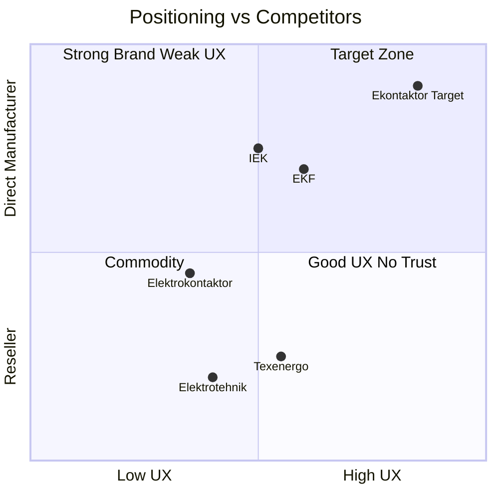
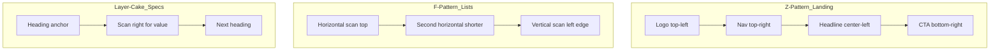
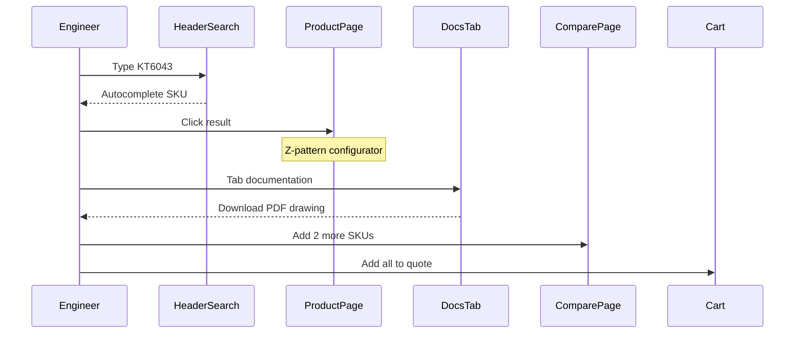

# ТЗ по дизайну сайта АО «Владикавказский завод «Электроконтактор»»

> **Версия:** 1.0 · 02.07.2026  
> **Статус:** Утверждение заказчиком  
> **Основание:** [TZ.md](../../TZ.md) §11, [PLAN.md](../../PLAN.md) STEP-005  
> **Связанные файлы:** [DESIGN_SYSTEM.md](./DESIGN_SYSTEM.md) (краткие токены), [wireframes/](./wireframes/), [design/tokens.css](../../design/tokens.css)

---

## Содержание

1. [Введение и цели](#1-введение-и-цели)
2. [Design North Star](#2-design-north-star)
3. [Целевая аудитория и design implications](#3-целевая-аудитория-и-design-implications)
4. [Конкурентный анализ](#4-конкурентный-анализ)
5. [Референсы: лучшие сайты отрасли](#5-референсы-лучшие-сайты-отрасли)
6. [UX-исследования: куда смотрят пользователи](#6-ux-исследования-куда-смотрят-пользователи)
7. [Маркетинговая психология B2B](#7-маркетинговая-психология-b2b)
8. [Тренды веб-дизайна 2025–2026 (применимые)](#8-тренды-веб-дизайна-20252026-применимые)
9. [Визуальная концепция](#9-визуальная-концепция)
10. [Цветовая палитра (финальная)](#10-цветовая-палитра-финальная)
11. [Типографика](#11-типографика)
12. [Иконография и иллюстрации](#12-иконография-и-иллюстрации)
13. [Фото-стратегия без полного архива](#13-фото-стратегия-без-полного-архива)
14. [Логотип и брендинг](#14-логотип-и-брендинг)
15. [UX-сценарии](#15-ux-сценарии)
16. [Спецификация экранов](#16-спецификация-экранов)
17. [Design System для разработчиков](#17-design-system-для-разработчиков)
18. [Микроанимации и интерактив](#18-микроанимации-и-интерактив)
19. [Адаптивность и breakpoints](#19-адаптивность-и-breakpoints)
20. [Доступность (a11y)](#20-доступность-a11y)
21. [Gap analysis: текущая реализация vs целевой дизайн](#21-gap-analysis-текущая-реализация-vs-целевой-дизайн)
22. [Чеклист контента от заказчика](#22-чеклист-контента-от-заказчика)
23. [Критерии приёмки дизайна (UAT)](#23-критерии-приёмки-дизайна-uat)
24. [Источники и ссылки](#24-источники-и-ссылки)

---

## 1. Введение и цели

### 1.1 Задача документа

Настоящее ТЗ по дизайну определяет **визуальный язык, UX-логику и компонентную систему** сайта производителя низковольтной аппаратуры. Документ предназначен для:

- **UI/UX-дизайнера** — отрисовка макетов (Figma) или согласование текущей вёрстки;
- **Frontend-разработчика** — реализация в Next.js 15 + Tailwind CSS 4 + shadcn/ui;
- **Заказчика** — приёмка визуального качества и конверсионности.

Функциональные требования (API, корзина, фильтры, SEO) описаны в [TZ.md](../../TZ.md). Данный документ **не дублирует FR-*, а дополняет их визуальными и UX-решениями**.

### 1.2 Бизнес-цели дизайна

| Цель | KPI | Design-решение |
|---|---|---|
| Конверсия в заявку | Time to quote < 3 мин | CTA «В заявку» на каждом экране, короткая форма |
| Доверие производителя | Bounce rate < 40% на PDP | Trust architecture, бейджи, сертификаты |
| Удобство для инженера | Чертёж за 30 сек | Документация на PDP, поиск по артикулу |
| SEO и производительность | Lighthouse ≥ 90 | Лёгкий hero, WebP, skeleton UI |
| Отличие от конкурентов | Узнаваемость бренда | «Честный индустриальный дизайн», не шаблон e-commerce |

### 1.3 Ограничения на момент проектирования

- Брендбук отсутствует; есть **логотип** (SVG/PNG от заказчика).
- Фото продукции и производства **есть, однотипные** — не полный архив по всем SKU.
- Стек фиксирован: Next.js 15, Tailwind 4, shadcn/ui, Lucide icons.

---

## 2. Design North Star

### Концепция: «Честный индустриальный дизайн»

> Сайт завода — это цифровой цех, где инженер находит чертёж за 30 секунд, а закупщик убеждается в надёжности поставщика без долгих переговоров.

**Принципы:**

1. **Информация важнее декора** — характеристики, артикулы, документы на виду; минимум «маркетингового шума».
2. **Промышленный минимализм** — чистые линии, много воздуха, строгая сетка 8px, акцент на технические детали.
3. **Честность и прозрачность** — реальные фото (когда есть), публичные цены, открытые паспорта, блок антиконтрафакта.
4. **Скорость и точность** — поиск, фильтры, конфигуратор без перезагрузки; monospace для SKU.
5. **Конверсия без агрессии** — один акцентный CTA-цвет на экране; не «магазин скидок».

**Anti-patterns (чего избегать):**

- Стоковые фото «улыбающихся людей в касках»
- Красные бейджи «-30%», countdown-таймеры
- Скрытая документация за регистрацией
- Перегруженный header с 15 пунктами меню
- Autoplay video hero (> 500 KB без lazy load)

---

## 3. Целевая аудитория и design implications

### 3.1 Персоны

| Персона | Первый взгляд (0–3 сек) | Критичный UI | Паттерн сканирования |
|---|---|---|---|
| **Инженер-конструктор** | Артикул, ток, катушка, чертёж | Поиск, фильтры, PDP tabs, сравнение | F-pattern + layer-cake на specs |
| **Закупщик / снабженец** | Цена «от X ₽», корзина, итог | ProductCard, Cart, PDF export | F-pattern, таблицы |
| **Техдиректор / ЛПР** | «С 1956», сертификаты, масштаб | Главная, О заводе, trust strip | Z-pattern на landing |
| **Дилер** | Прайс, серии, быстрая заявка | Каталог, dealers form | F-pattern + быстрый CTA |
| **Маркетолог завода** | — | CMS (не в scope дизайна) | — |

### 3.2 Design implications по персонам

**Инженер:**
- Глобальный поиск в header — **always visible** (desktop), иконка + expand (mobile).
- Артикул в **JetBrains Mono**, копирование по клику.
- Таб «Документация» — иконки PDF/DWG, размер файла, без captcha.
- Блок «Структура обозначения» — интерактивная расшифровка, не plain text.

**Закупщик:**
- Цена с **tabular-nums**, формат «25 100 ₽ с НДС».
- Mini-cart в header: количество + сумма.
- Корзина: таблица как спецификация, экспорт PDF/XLSX до отправки.

**ЛПР:**
- Hero: один сильный claim + 3 trust badges в первом экране.
- Цифры завода (70+ лет, SKU, сотрудники) — **stats block** с крупной типографикой.
- Timeline истории — визуальная, не просто текст.

---

## 4. Конкурентный анализ

### 4.1 Прямые конкуренты (контакторы / перепродажа)

| Сайт | Сильные стороны | Слабые стороны | Урок для нас |
|---|---|---|---|
| [elektrotehnik.ru](https://www.elektrotehnik.ru/) | PDF-каталоги, знание рынка | Дистрибьютор, не производитель; нет faceted filter; specs в PDF | Открытые specs на странице |
| [texenergo.com](https://www.texenergo.com/) | Огромный каталог (84k+), ЛК, API | Перекупщик; перегруженность; КТ/КТП под своим брендом | Акцент «завод с 1956», не marketplace |
| [elektrokontaktor.ru](https://www.elektrokontaktor.ru/) | Базовая корзина | UI ~2010-х; неясный статус производителя | Современный Industrial Premium UI |

### 4.2 Российские производители (электротехника)

| Сайт | Сильные стороны | Слабые стороны | Урок для нас |
|---|---|---|---|
| [iek.ru](https://iek.ru/) | Бренды серий (ARMAT, BRITE), каталог | Очень тяжёлый каталог, медленные страницы | Серии как визуальные блоки на главной |
| [ekfgroup.com](https://ekfgroup.com/) | Конфигураторы, ETIM, отраслевые решения | Широкий ассортимент — сложная навигация | Landing «Применение» (краны, НКУ) |

### 4.3 Мировые эталоны

| Сайт | Сильные стороны | Что берём |
|---|---|---|
| **ABB** (e-Configure) | Документация на странице, BOM export, guided selection | UX конфигуратора, список docs с иконками |
| **Schneider Electric** | Product configurators, mySchneider portal | Chips для выбора исполнения, trust badges |
| **Siemens** (iX Design System) | Единая design system, чистая типографика | 8px grid, consistent components |
| **CHINT Global** | Master catalogs, category browse | Карточки категорий с иконками |

### 4.4 Окно возможности (наше УТП в дизайне)



**Визуально коммуницировать:**
- «Производитель с 1956» — hero + badge на каждой карточке
- «Честный знак» — tooltip + блок антиконтрафакта
- «100% РФ, медные контакты» — trust strip
- Документация в 1 клик — таб на PDP, не PDF-only

---

## 5. Референсы: лучшие сайты отрасли

| # | Референс | URL | Берём | Не берём |
|---|---|---|---|---|
| 1 | ABB Low Voltage | new.abb.com | Чистый catalog UX, e-Configure flow | Масштаб 40k SKU, AI search (Phase 2) |
| 2 | Schneider Electric | se.com | Product configurator chips, documentation hub | Глобальный mega-menu |
| 3 | Siemens Product Configurator | siemens.com | Single-page configurator, responsive tool | Industry Mall интеграция |
| 4 | IEK GROUP | iek.ru | Серии как бренды, категорийные блоки | Тяжёлый legacy catalog |
| 5 | EKF Group | ekfgroup.com | Отраслевые landing, калькуляторы | Слишком «consumer smart home» tone |
| 6 | Pixerts Industrial Best Practices | pixerts.com | 8px grid, AEO structure, trust placement | — |
| 7 | NN/g F-Pattern | nngroup.com | Паттерны сканирования для layout | — |

---

## 6. UX-исследования: куда смотрят пользователи

### 6.1 Паттерны сканирования (Nielsen Norman Group, IxDF)



| Паттерн | Где применять | Design-правило |
|---|---|---|
| **Z-pattern** | Главная hero, Applications landing, Dealers | Logo слева → nav справа → H1 → CTA в правом нижнем секторе hero |
| **F-pattern** | Каталог, новости, FAQ, результаты поиска | Ключевые слова в начале строк; фильтры слева; артикул в первых 2 строках карточки |
| **Layer-cake** | PDP specs, сравнение, корзина-таблица | Подзаголовки как якоря; label слева, value справа; чередование фона строк |
| **Spotted** | Autocomplete dropdown | SKU и series_code выделены bold/color |

### 6.2 Приоритеты внимания (первые 3–5 секунд)

**Header (все страницы):**
1. Логотип (левый верх) — идентификация бренда
2. Поиск (центр-право) — главный инструмент инженера
3. Телефон / корзина (правый край) — action items

**PDP above the fold:**
1. Название + артикул
2. Цена
3. Кнопка «Добавить в заявку»
4. Фото продукта (левая колонка — периферийное зрение)

**Каталог:**
1. Активные filter chips (что применено)
2. Количество результатов
3. Первый ряд карточек (ток + цена в card)

### 6.3 Правило 3 кликов

| Сценарий | Путь | Кликов |
|---|---|---|
| Найти контактор 400А | Каталог → фильтр → PDP | 2–3 |
| Скачать чертёж | PDP → таб Документация → Download | 2 |
| Отправить заявку | PDP → В заявку → Cart → Submit | 3–4 |
| Сравнить 3 модели | PDP × 3 → Compare | 4 |

---

## 7. Маркетинговая психология B2B

### 7.1 Trust Architecture (архитектура доверия)

По слоям страницы (DAR Design, DesignRush B2B research, Inkbot 2026):

| Слой | Вопрос пользователя | Design-элемент | Страницы |
|---|---|---|---|
| **0–1 scroll (Hero)** | «Можно ли доверять?» | Logo, «С 1956», Честный знак, телефон | Главная, PDP |
| **Mid-page** | «Подходит ли мне?» | Цифры, серии, отрасли, сертификаты | Главная, About, Applications |
| **Pre-CTA** | «Безопасно ли отправить?» | «Что будет дальше», PDF preview, privacy link | Cart, формы |
| **Post-action** | «Всё прошло?» | Номер заявки ЗК-YYYY-NNNNN, email confirm | Order success |

**Правило:** trust signals **рядом с claim**, не только на `/about/`.

Пример: на PDP рядом с «Медные контакты, 100% РФ» — иконка сертификата EAC, не ссылка «подробнее на другой странице».

### 7.2 Социальное доказательство для промышленного B2B

| Формат | Приоритет | Где размещать |
|---|---|---|
| Сертификаты (EAC, ISO) | Высокий | Trust strip, About, PDP footer |
| Цифры завода (70+ лет, X SKU) | Высокий | Hero stats, About |
| Кейсы применения (краны, метро) | Средний | Applications pages |
| Логотипы клиентов | Средний | About (если есть разрешение) |
| Отзывы | Низкий для MVP | Phase 2 — только с именем, должностью, компанией |

**Anti-pattern:** «стена логотипов» без контекста — не использовать.

### 7.3 Психология CTA и форм

Исследования конверсии manufacturing/B2B (MarketingSherpa, Forrester):

| Принцип | Рекомендация | Реализация |
|---|---|---|
| Количество полей | 5–7 обязательных max | ФИО, компания, email, телефон, согласие; ИНН/город — optional |
| Dropdown vs text | Dropdowns −15% abandonment | Исполнение — chips; катушка — select |
| CTA copy | Конкретное действие | «Добавить в заявку», не «Отправить» |
| CTA color | Единственный accent на экране | Terracotta `#E87A20` только для conversion |
| Mobile forms | Single column, 44px touch | Cart form stack на mobile |
| Post-submit | Немедленное подтверждение | Success page + toast + email |

### 7.4 Cognitive load (снижение нагрузки)

- **Chunking:** specs в таблицы, не prose
- **Progressive disclosure:** конфигуратор → tabs → FAQ accordion
- **Recognition over recall:** filter chips показывают активные фильтры
- **Consistency:** один стиль карточки в catalog/search/related

---

## 8. Тренды веб-дизайна 2025–2026 (применимые)

| Тренд | Применение у нас | Не применять |
|---|---|---|
| Industrial Premium UI | Чистый B2B, card catalog, navy + white | Dark mode как default |
| Skeleton loading | Catalog, PDP, search results | Full-page spinners |
| Sticky configurator / CTA | PDP mobile bottom bar | Sticky на desktop (не нужен) |
| Faceted filters без reload | URL sync + optimistic UI | Infinite scroll без pagination |
| Monospace SKU | JetBrains Mono для артикулов | Decorative fonts |
| Tabular nums для цен | `font-variant-numeric: tabular-nums` | — |
| AEO-ready FAQ blocks | Accordion на PDP/Support | Wall of text |
| Core Web Vitals as constraint | Hero без autoplay video; WebP; lazy images | Heavy parallax, Lottie backgrounds |
| 8px grid system | Все spacing tokens | Arbitrary px values |
| Subtle micro-motion | 150–250ms transitions | Bounce animations, confetti |

**Phase 2 (не MVP):** AI search, 3D configurator, personalization, customer portal.

---

## 9. Визуальная концепция

### 9.1 Moodboard (словами)

| Измерение | Описание |
|---|---|
| **Атмосфера** | Цех, точность, надёжность — не «стартап», не «склад» |
| **Текстуры** | Матовый металл, светлый бетон, чистый белый фон карточек |
| **Свет** | Холодный рассеянный (как в производственном hall), не тёплый «cozy» |
| **Формы** | Прямоугольники, radius 6–8px, без pill-кнопок |
| **Фото** | Реальные продукты на едином светло-сером фоне; цех — контрастный, честный |
| **Tone of voice (UI)** | Нейтрально-технический: «Контактор КТ 6043 400А», не «Лучший контактор!» |

### 9.2 Визуальная иерархия (5 уровней)

| Уровень | Элемент | Пример |
|---|---|---|
| 1 | H1, цена PDP | Manrope 40px/28px bold |
| 2 | H2 секций, название карточки | Manrope 24–32px semibold |
| 3 | Body, specs labels | Inter 16px regular |
| 4 | Captions, meta | Inter 14px muted |
| 5 | SKU, codes | JetBrains Mono 14px |

---

## 10. Цветовая палитра (финальная)

### 10.1 Согласование TZ §11.1 и tokens.css

В [TZ.md](../../TZ.md) §11.1 указаны `#0A1628`, `#0066CC`, `#F59E0B`.  
В [globals.css](../../frontend/src/app/globals.css) и [DESIGN_SYSTEM.md](./DESIGN_SYSTEM.md) — Variant B: `#0077AF`, `#E87A20`.

**Финальное решение (Variant B — утверждённое):** более тёплый industrial blue + terracotta CTA. Тёмный navy из TZ — для hero gradient end.

### 10.2 Palette

| Token | HEX | RGB | Использование |
|---|---|---|---|
| `--color-brand-blue-darker` | `#003456` | 0, 52, 86 | Hero gradient end, footer depth |
| `--color-brand-blue-dark` | `#005684` | 0, 86, 132 | Header, footer bg |
| `--color-brand-blue` | `#0077AF` | 0, 119, 175 | Primary buttons, links, focus ring |
| `--color-brand-blue-light` | `#E5F1F8` | 229, 241, 248 | Badge bg, SKU highlight, selected chip |
| `--color-cta` | `#E87A20` | 232, 122, 32 | **Только** «В заявку», «Отправить заявку» |
| `--color-cta-hover` | `#C96815` | 201, 104, 21 | Hover CTA |
| `--color-text-primary` | `#1A2530` | 26, 37, 48 | Body text, prices |
| `--color-text-secondary` | `#5A6B7C` | 90, 107, 124 | Labels, captions |
| `--color-bg-light` | `#F6F9FC` | 246, 249, 252 | Section alternate bg |
| `--color-surface` | `#FFFFFF` | 255, 255, 255 | Cards, modals |
| `--color-border-light` | `#DCE4EC` | 220, 228, 236 | Card borders, table lines |
| `--color-success` | `#2E9B5C` | 46, 155, 92 | «В наличии» |
| `--color-error` | `#DC2626` | 220, 38, 38 | Validation errors |
| `--color-warning` | `#D97706` | 217, 119, 6 | «Под заказ», anti-counterfeit |

### 10.3 Правила использования цвета

| Правило | Описание |
|---|---|
| **One accent rule** | Terracotta CTA — max 1–2 экземпляра на viewport |
| **Blue hierarchy** | dark → header; base → interactive; light → backgrounds |
| **No red sale badges** | Красный только error; не «акции» |
| **Contrast** | Text on white ≥ 4.5:1; CTA white text on `#E87A20` ≥ 4.5:1 |
| **Gradient hero** | `linear-gradient(135deg, #005684 0%, #003456 100%)` |

### 10.4 CSS implementation

Источник правды: [frontend/src/app/globals.css](../../frontend/src/app/globals.css).  
Legacy [design/tokens.css](../../design/tokens.css) — синхронизировать при visual refactor (сейчас содержит старые `#0A1628` / `#0066CC`).

---

## 11. Типографика

### 11.1 Шрифты

| Роль | Шрифт | Fallback | Загрузка |
|---|---|---|---|
| Display (H1–H3) | **Manrope** | system-ui, sans-serif | next/font google |
| Body | **Inter** | system-ui, sans-serif | next/font google |
| SKU / code | **JetBrains Mono** | ui-monospace, monospace | next/font google |

### 11.2 Scale (desktop / mobile)

| Token | Desktop | Mobile | Weight | Line-height |
|---|---|---|---|---|
| `--text-h1` | 40px / 2.5rem | 28px / 1.75rem | 700 | 1.2 |
| `--text-h2` | 32px / 2rem | 24px / 1.5rem | 600 | 1.25 |
| `--text-h3` | 24px / 1.5rem | 20px / 1.25rem | 600 | 1.3 |
| `--text-body` | 16px / 1rem | 16px | 400 | 1.5 |
| `--text-small` | 14px / 0.875rem | 14px | 400 | 1.45 |
| `--text-price` | 28px | 24px | 700 | 1.2 |
| `--text-sku` | 14px | 14px | 500 | 1.4 |

### 11.3 Правила

- **Prices:** `font-variant-numeric: tabular-nums`; suffix «₽» с пробелом: `25 100 ₽`
- **SKU:** always mono; optional `user-select: all` + copy button
- **Max line length:** 65–75 chars для body prose
- **Uppercase:** только для badges (EAC, КТ), не для headings

---

## 12. Иконография и иллюстрации

### 12.1 Icons

- **Библиотека:** Lucide React (единственная)
- **Stroke:** 1.5px default, 2px для emphasis
- **Sizes:** 16px inline, 20px buttons, 24px nav, 32px trust block
- **Color:** inherit или `currentColor`; trust icons — `--color-brand-blue`

### 12.2 Category icons (7 категорий)

Для `/catalog/` root — иконка + название, без фото до получения assets:

| Категория | Lucide icon | Цвет фона card |
|---|---|---|
| Контакторы КТ | `Zap` | `--color-brand-blue-light` |
| Контакторы КТП | `Battery` | `--color-brand-blue-light` |
| Контакторы КТЭ | `TrainFront` | `--color-brand-blue-light` |
| Аксессуары | `Puzzle` | `--color-bg-light` |
| Выключатели | `Power` | `--color-bg-light` |
| Кулачковые элементы | `CircleDot` | `--color-bg-light` |
| Пакетные переключатели | `ToggleRight` | `--color-bg-light` |

### 12.3 Decorative illustrations

- MVP: **не использовать** custom SVG illustrations
- Допустимо: тонкий line-pattern в hero (`radial-gradient` overlay — уже в `HeroSection`)
- Чertёж как decorative: watermark opacity 5% на placeholder product

---

## 13. Фото-стратегия без полного архива

### 13.1 Проблема

Фото есть, **однотипные** — недостаточно для 80+ SKU и разнообразных hero-блоков.

### 13.2 Placeholder system

| Тип | Asset | Spec |
|---|---|---|
| Product default | [placeholder-product.svg](../../frontend/public/placeholder-product.svg) | SVG, серый контур контактора, 4:3 |
| Category | Lucide icon 48px | См. §12.2 |
| Hero production | `photos/XXXL.webp` или gradient-only | 1920×800 max, WebP q=80 |
| About production | Grid 2×2 однотипных фото | Object-fit cover, radius 8px |
| Certificate | PDF thumbnail или generic `Award` icon | 3:4 card |

### 13.3 Placeholder product card visual

```
┌─────────────────────────┐
│  ░░░ light gray bg ░░░  │
│     [outline icon]      │
│  ─────────────────────  │
│  КТ 6043 400А           │
│  от 25 100 ₽            │
└─────────────────────────┘
```

- Фон image area: `#F6F9FC`
- Padding product image: 12px
- Badge «Производитель» — always visible (даже на placeholder)

### 13.4 Hero fallback (без video)

**Приоритет слоёв hero:**
1. Gradient background (always)
2. Optional: production photo right 50%, overlay gradient left (когда фото есть)
3. Typographic lockup left: H1 + subline + CTA
4. Radial highlight top-right (subtle, уже реализовано)

**Не использовать:** autoplay video (LCP impact).

### 13.5 Когда появятся фото

| Приоритет | Что запросить | Куда |
|---|---|---|
| P0 | Logo SVG (white + color) | Header, footer, PDF |
| P1 | 3 hero shots (цех, сборка, продукт) | Главная, About |
| P2 | Top-20 SKU studio photos | ProductGroup primary image |
| P3 | Сертификаты scan | About/certificates |
| P4 | Остальные SKU | Batch upload via admin |

Единый studio-bg для продуктов: `#F0F2F5` или light gray seamless.

---

## 14. Логотип и брендинг

### 14.1 Текущее состояние

Header использует текст «Электроконтактор» ([Header.tsx](../../frontend/src/components/layout/Header.tsx)) — заменить на SVG.

### 14.2 Placement rules

| Место | Variant | Min height | Clear space |
|---|---|---|---|
| Header | White/light on dark bg | 32px (mobile), 40px (desktop) | 0.5× logo height |
| Footer | White | 28px | 0.5× |
| PDF/email | Color | 48px | 1× |
| Favicon | Simplified mark | 32×32 | — |

### 14.3 Co-branding

- «Честный знак» — official mark + tooltip, не перерисовывать
- EAC — text badge или icon badge
- Не размещать логотипы конкурентов

---

## 15. UX-сценарии

### 15.1 Инженер: подбор по артикулу



| Шаг | Desktop | Mobile | Trust point |
|---|---|---|---|
| 1. Поиск | Ctrl+K focus search | Tap search icon | SKU highlight |
| 2. PDP | Configurator right | Sticky bar bottom | Badge Честный знак |
| 3. Docs | Tab visible | Tab scroll | PDF icon + size |
| 4. Compare | Table diff highlight | Horizontal scroll | — |
| 5. Cart | Sidebar total | Stack table | Privacy checkbox |

**Max time target:** 90 секунд до скачанного чертежа.

### 15.2 Закупщик: спецификация и КП

| Шаг | Действие | UI |
|---|---|---|
| 1 | Каталог → фильтр 400А, 220В | Sidebar + chips |
| 2 | Add 5 позиций | «В заявку» on cards |
| 3 | Cart review | Table + qty stepper |
| 4 | Export PDF preview | Button before submit |
| 5 | Fill form (5 fields) | Name, company, email, phone, consent |
| 6 | Success | ЗК-2026-NNNNN + email |

### 15.3 ЛПР: оценка производителя

| Шаг | Страница | Key visual |
|---|---|---|
| 1 | Главная hero | «С 1956», trust badges |
| 2 | О заводе | Timeline + stats |
| 3 | Сертификаты | Gallery grid |
| 4 | Контакты | Map + phones |

**Max clicks:** 3 до контакта менеджера.

---

## 16. Спецификация экранов

### D1. Header / Footer

**Header** — sticky, `z-50`, bg `--color-brand-blue-dark`, height ~64px.

```
┌──────────────────────────────────────────────────────────────────┐
│ [LOGO]  Каталог  О заводе  Новости  Контакты   [🔍 Search] [📞] [⇄] [🛒] │
└──────────────────────────────────────────────────────────────────┘
```

| Элемент | Spec |
|---|---|
| Logo | SVG, link to `/` |
| Nav | 4 items max visible; active = underline accent |
| Search | min-width 240px desktop; debounce 300ms |
| Phone | Click-to-call, icon + number on lg+ |
| Compare | Badge count, max 4 |
| Cart | Badge count + sum on hover (desktop) |
| Mobile | Hamburger → Sheet; search in sheet |

**Footer** — 4 columns desktop, stack mobile; bg `--color-brand-blue-dark`.

| Col | Content |
|---|---|
| 1 | Logo + tagline + requisites |
| 2 | Contacts (address, email, phone) |
| 3 | Nav links |
| 4 | Subscribe form |

**Component:** [Header.tsx](../../frontend/src/components/layout/Header.tsx), [Footer.tsx](../../frontend/src/components/layout/Footer.tsx)

---

### D2. Главная `/`

**Pattern:** Z-pattern hero → F-pattern content sections.

```
┌──────────────────────────────────────────────────────────────────┐
│ HERO (gradient + optional photo)                                 │
│   [Badge: С 1956 года]                                           │
│   H1: Производитель контакторов с 1956 года                      │
│   Subline: КТ, КТП, КТЭ · Прямые поставки · Публичные цены       │
│   [Подобрать контактор]  [О заводе]                              │
├──────────────────────────────────────────────────────────────────┤
│ TRUST STRIP: [Честный знак] [100% РФ] [EAC]                      │
├──────────────────────────────────────────────────────────────────┤
│ SERIES GRID (4 cards)                                            │
├──────────────────────────────────────────────────────────────────┤
│ FEATURED PRODUCTS (4 cards) + NEWS (3 items)                     │
├──────────────────────────────────────────────────────────────────┤
│ SUBSCRIBE (gradient band)                                        │
├──────────────────────────────────────────────────────────────────┤
│ ANTI-COUNTERFEIT BANNER                                          │
└──────────────────────────────────────────────────────────────────┘
```

| Block | Priority | CTA | Mobile |
|---|---|---|---|
| Hero | P1 | «Подобрать контактор» accent | Stack buttons full-width |
| Trust strip | P1 | — | Horizontal scroll or 1 col |
| Series | P2 | Card → catalog | 2×2 grid |
| Featured | P2 | «В заявку» per card | 1 col |
| News | P3 | Read more link | 1 col |
| Subscribe | P3 | Email input | Full width |
| Anti-counterfeit | P2 | Link contacts | Compact |

**Component:** [HomeSections.tsx](../../frontend/src/components/home/HomeSections.tsx), [FeaturedProducts.tsx](../../frontend/src/components/home/FeaturedProducts.tsx)

---

### D3. Каталог `/catalog/`, `/catalog/[...slug]/`

**Pattern:** F-pattern — filters left, grid right.

```
┌──────────────┬───────────────────────────────────────────────────┐
│ FILTERS      │ Breadcrumbs                                       │
│ ──────────── │ Title + count · [Grid|List] · Sort · Per page     │
│ Ток □80 □400 │ Active chips: [400А ×] [220В ×] [Сбросить]       │
│ Катушка      │ ┌────┐ ┌────┐ ┌────┐ ┌────┐                      │
│ Исполнение   │ │card│ │card│ │card│ │card│                      │
│ [Сбросить]   │ └────┘ └────┘ └────┘ └────┘                      │
│              │ Pagination                                        │
└──────────────┴───────────────────────────────────────────────────┘
```

| Element | Spec |
|---|---|
| Filter sidebar | width 260px; sticky top 80px |
| Active chips | below toolbar; removable |
| Product card | See D3 card spec below |
| Grid | 4 col xl, 3 lg, 2 sm, 1 xs |
| List view | Horizontal card, image 112px |
| Empty state | Illustration + «Сбросить фильтры» |
| Loading | Skeleton cards 6× |
| Mobile filters | Bottom Sheet |

**ProductCard visual spec:**

| Zone | Content | Typography |
|---|---|---|
| Image | 4:3, badge «Производитель» top-left | — |
| Title | Product name | Manrope semibold 16px |
| Meta | `{current} А` | Inter 14px muted |
| Price | `от {price} ₽` | Manrope bold 18px |
| Actions | Outline «Подробнее» + Accent «В заявку» | sm buttons |

**Component:** [ProductCard.tsx](../../frontend/src/components/catalog/ProductCard.tsx), [CatalogFilters.tsx](../../frontend/src/components/catalog/CatalogFilters.tsx)

---

### D4. PDP `/catalog/.../product/`

**Pattern:** Layer-cake below fold; above fold — split 50/50.

```
┌────────────────────────────┬─────────────────────────────────────┐
│ GALLERY                    │ H1 + Badges                         │
│ [primary image]            │ SKU (mono)                          │
│ [thumb][thumb][thumb]      │ Execution chips · Coil select       │
│                            │ Qty stepper                         │
│                            │ PRICE (large)                       │
│                            │ [■ Add to quote] [Compare]          │
│                            │ [Download passport]                 │
├────────────────────────────┴─────────────────────────────────────┤
│ [Описание] [Характеристики] [Документация]                       │
│ Tab content…                                                     │
│ Designation structure (interactive)                              │
├──────────────────────────────────────────────────────────────────┤
│ Related · Accessories · FAQ                                      │
│ Anti-counterfeit compact                                         │
└──────────────────────────────────────────────────────────────────┘
│ MOBILE STICKY: price + [В заявку]                               │
└──────────────────────────────────────────────────────────────────┘
```

| Element | Spec |
|---|---|
| Gallery | Primary + thumbs; click zoom (optional Phase 2) |
| Badges | «Производитель», «Честный знак» tooltip |
| Configurator | Chips for execution; Select for coil |
| Price update | Instant on variant change, no page reload |
| Tabs | Underline active; 3 min tabs visible |
| Docs tab | File type icon, name, size, download btn |
| Sticky bar | mobile only; `pb-24` on page for clearance |

**Component:** [ProductDetailPage.tsx](../../frontend/src/components/product/ProductDetailPage.tsx), [ProductConfigurator.tsx](../../frontend/src/components/product/ProductConfigurator.tsx), [ProductTabs.tsx](../../frontend/src/components/product/ProductTabs.tsx)

---

### D5. Сравнение `/compare/`

| Element | Spec |
|---|---|
| Table | Sticky first column (spec name) |
| Diff highlight | Changed values — `--color-brand-blue-light` bg |
| Empty | «Добавьте до 4 товаров» + link catalog |
| CTA | «Добавить все в заявку» accent button |

---

### D6. Корзина `/cart/`

```
┌──────────────────────────────────────────────┬───────────────────┐
│ SPEC TABLE                                   │ SUMMARY           │
│ img · sku · name · price · qty · total       │ 3 позиции         │
│ [Clear cart]                                 │ 75 300 ₽ с НДС    │
│ [Export PDF] [Export Excel]                  │ ─────────────     │
├──────────────────────────────────────────────┴───────────────────┤
│ QUOTE FORM                                                         │
│ Name* · Company* · Email* · Phone* · City · INN · Comment          │
│ ☑ Privacy policy                                                   │
│ [Отправить заявку]                                                 │
│ «Менеджер свяжется в течение 1 рабочего дня»                     │
└──────────────────────────────────────────────────────────────────┘
```

| Element | Spec |
|---|---|
| Table | Striped rows; tabular nums |
| Qty stepper | Inline, min 1 max 9999 |
| Summary | Sticky sidebar desktop; top mobile |
| Form validation | Inline errors red; success green check |
| Submit loading | Spinner in button, disabled state |

**Success page:** Large checkmark, `ЗК-2026-NNNNN`, «PDF отправлен на email».

**Component:** [CartPageClient.tsx](../../frontend/src/components/cart/CartPageClient.tsx), [QuoteForm.tsx](../../frontend/src/components/cart/QuoteForm.tsx)

---

### D7. Поиск `/search/` + Autocomplete

| Element | Spec |
|---|---|
| Dropdown | Max 8 results; group by type (SKU, Product, Category) |
| Highlight | Match bold `--color-brand-blue` |
| Keyboard | Arrow nav, Enter select, Esc close |
| Results page | Same ProductCard; query in breadcrumb |

**Component:** [SearchAutocomplete.tsx](../../frontend/src/components/layout/SearchAutocomplete.tsx)

---

### D8. О заводе `/about/`

| Section | Visual |
|---|---|
| Hero | H1 + subline on gradient or photo |
| Stats | 4 counters in row (70+ лет, SKU, сотрудники, 100% РФ) |
| Timeline | Horizontal desktop, vertical mobile; year markers |
| Production | Photo grid 2×2 or masonry |
| Certificates | Card grid with PDF link |
| CTA | «Связаться» + «Каталог» |

---

### D9. Контакты `/contacts/`

| Block | Spec |
|---|---|
| Map | Yandex iframe, radius 8px, height 400px |
| Departments | Accordion or table phones/emails |
| Requisites | Copy-friendly mono block |
| Quick forms | Callback + Contact modals |

---

### D10. Support `/support/`

- FAQ accordion — layer-cake pattern
- Search within FAQ (optional)
- Contact section bottom

---

### D11. Landing template (Dealers, Applications)

Reusable template:

```
Hero (H1 + 1 sentence) → Proof (3 bullets) → Product recommendations → CTA form
```

**Pattern:** Z-pattern; one primary CTA per page.

---

## 17. Design System для разработчиков

### 17.1 Spacing (8px base)

| Token | Value | Usage |
|---|---|---|
| `--space-1` | 4px | Tight inline |
| `--space-2` | 8px | Icon gap |
| `--space-3` | 12px | Card padding mobile |
| `--space-4` | 16px | Default gap |
| `--space-6` | 24px | Grid gap catalog |
| `--space-8` | 32px | Section inner |
| `--space-16` | 64px | Section padding desktop |
| `--space-10` | 40px | Section padding mobile |

### 17.2 Layout grid

| Token | Value |
|---|---|
| Container max | 1280px (`container-page`) |
| Padding X | 16px mobile, 24px tablet+ |
| Catalog grid | 12 columns; sidebar span 3, content span 9 |
| Product grid | CSS grid auto-fill minmax(260px, 1fr) |

### 17.3 Components (shadcn/ui mapping)

#### Button

| Variant | Bg | Text | Usage |
|---|---|---|---|
| `default` | `--color-brand-blue` | white | Подробнее, Скачать, Фильтр |
| `accent` | `--color-cta` | white | **В заявку**, Отправить заявку |
| `outline` | transparent | `--color-brand-blue` | Secondary actions |
| `ghost` | transparent | inherit | Header icons |
| `destructive` | `--color-error` | white | Delete cart item |

**States:** hover → darken 10%; focus → ring 2px `--color-brand-blue` offset 2px; disabled → opacity 50%; loading → spinner.

#### Badge

| Variant | Usage |
|---|---|
| `brand` | «Производитель» |
| `accent` | «Хит продаж» |
| `neutral` | «Честный знак», EAC |
| `success` | «В наличии» |
| `warning` | «Под заказ» |

#### Card

- Border: 1px `--color-border-light`
- Radius: 8px
- Shadow: `0 1px 3px rgba(10,22,40,0.08)`
- Hover: border `--color-brand-blue`, shadow md, translateY -2px

#### Form inputs

- Height: 44px (touch target)
- Border: 1px `--color-border-light`; focus border `--color-brand-blue`
- Error: border `--color-error` + message below 12px
- Label: 14px medium, margin-bottom 4px

#### Table (specs, cart, compare)

- Header: bg `--color-bg-light`, font medium 14px
- Row: border-bottom 1px; even row optional tint
- Numeric columns: right-align, tabular-nums

---

## 18. Микроанимации и интерактив

| Interaction | Spec | Duration | Easing |
|---|---|---|---|
| Card hover | translateY(-2px), shadow md | 200ms | ease-out |
| Button hover | background darken | 150ms | ease |
| Filter apply | content fade  opacity 0.6→1 | 200ms | ease |
| Tab switch | underline slide | 200ms | ease-in-out |
| Add to cart | button scale 0.95→1 + toast | 250ms | spring-lite |
| Skeleton pulse | opacity 0.5–1 loop | 1.5s | ease-in-out |
| Page section reveal | fade-in-up 16px | 400ms | ease-out |
| Success submit | checkmark draw | 300ms | ease |

**Reduced motion:** respect `prefers-reduced-motion: reduce` — disable transforms.

---

## 19. Адаптивность и breakpoints

| Name | Min width | Layout changes |
|---|---|---|
| `xs` | 0 (320+) | 1 col catalog; sticky CTA; sheet nav |
| `sm` | 640px | 2 col catalog; search visible |
| `md` | 768px | 2 col series; cart table scroll |
| `lg` | 1024px | Filter sidebar; 3 col catalog |
| `xl` | 1280px | 4 col catalog; container max |
| `2xl` | 1400px | Optional wider hero image |

### Mobile-specific

- PDP bottom sticky bar height 56px + safe-area-inset
- Phone click-to-call in header always visible
- Forms: single column, 16px font (no iOS zoom)
- Tables: horizontal scroll with shadow hint

---

## 20. Доступность (a11y)

| Requirement | Implementation |
|---|---|
| WCAG 2.1 AA | Contrast verified for all text |
| Keyboard nav | Tab order logical; skip-to-content link |
| Focus visible | 2px ring on all interactive |
| Touch targets | Min 44×44px |
| Images | alt text from CMS |
| Forms | label + aria-describedby for errors |
| Icons | aria-hidden + text alternative |
| Language | `<html lang="ru">` |

---

## 21. Gap analysis: текущая реализация vs целевой дизайн

### 21.1 Реализовано (functional baseline)

| Area | Status | File(s) |
|---|---|---|
| Layout header/footer | ✅ Functional | `Header.tsx`, `Footer.tsx` |
| Design tokens | ✅ Variant B in globals.css | `globals.css` |
| Homepage sections | ✅ All blocks | `HomeSections.tsx` |
| Catalog + filters | ✅ URL sync | `CatalogFilters.tsx`, `CategoryListing.tsx` |
| ProductCard | ✅ Grid/list | `ProductCard.tsx` |
| PDP configurator | ✅ Variant URL | `ProductConfigurator.tsx` |
| PDP tabs | ✅ | `ProductTabs.tsx` |
| Cart + quote form | ✅ | `CartPageClient.tsx` |
| Compare | ✅ | `ComparePageClient.tsx` |
| Search autocomplete | ✅ | `SearchAutocomplete.tsx` |
| Wireframes | ✅ Text | `wireframes/README.md` |

### 21.2 Design gaps (visual refactor backlog)

| # | Gap | Current | Target | Priority | File |
|---|---|---|---|---|---|
| G1 | Logo | Text only | SVG logo | P0 | `Header.tsx`, `Footer.tsx` |
| G2 | Hero imagery | Gradient only | Gradient + optional photo layer | P1 | `HomeSections.tsx` |
| G3 | ProductCard character | Generic shadcn card | Industrial card: stronger price, mono SKU, hover lift | P1 | `ProductCard.tsx` |
| G4 | Category icons | Text/photo mixed | Lucide icon system §12.2 | P1 | `CategoryCard.tsx` |
| G5 | Trust architecture | Badges exist but not layered | Hero→mid→pre-CTA placement | P1 | Multiple |
| G6 | PDP visual polish | Functional configurator | Price prominence, doc icons, designation block styling | P1 | `ProductConfigurator.tsx`, `ProductTabs.tsx` |
| G7 | Stats block About | Basic content | Animated counters, timeline visual | P2 | `about/page.tsx` |
| G8 | tokens.css sync | Old TZ colors | Match globals.css Variant B | P2 | `design/tokens.css` |
| G9 | Micro-animations | Minimal transitions | Full §18 spec | P2 | Global + components |
| G10 | Copy SKU button | Missing | One-click copy | P2 | `ProductConfigurator.tsx` |
| G11 | Cart «what next» | Partial | Explicit post-submit messaging | P2 | `QuoteForm.tsx` |
| G12 | Section reveal scroll | None | Subtle fade-in-up | P3 | `globals.css` |

### 21.3 Refactor order (recommended)

1. Logo + tokens sync (G1, G8)
2. ProductCard + CategoryCard (G3, G4)
3. Hero + trust layering (G2, G5)
4. PDP polish (G6, G10)
5. Cart/About/animations (G7, G9, G11, G12)

---

## 22. Чеклист контента от заказчика

| # | Asset | Format | Priority | Used on |
|---|---|---|---|---|
| 1 | Логотип цветной | SVG или PNG @2x | P0 | Header, footer, PDF |
| 2 | Логотип белый | SVG | P0 | Header dark bg |
| 3 | Favicon | ICO/PNG 32×32 | P0 | Browser tab |
| 4 | Hero: цех/производство | WebP 1920×800 | P1 | Главная |
| 5 | Hero: продукт крупно | WebP | P1 | Главная, catalog |
| 6 | Top-20 SKU photos | WebP 800×600, единый фон | P1 | ProductCard |
| 7 | Сертификаты | PDF + preview JPG | P2 | About/certificates |
| 8 | Остальные SKU | Batch | P3 | Admin upload |
| 9 | Тексты timeline | Word/doc | P2 | About |
| 10 | Логотипы клиентов (если можно) | SVG | P3 | About |

---

## 23. Критерии приёмки дизайна (UAT)

### 23.1 Automated metrics

| Metric | Target |
|---|---|
| Lighthouse Performance | ≥ 90 (home, catalog, PDP) |
| Lighthouse SEO | ≥ 90 |
| Lighthouse Accessibility | ≥ 90 |
| LCP | < 2.5s |
| CLS | < 0.1 |
| CTA contrast ratio | ≥ 4.5:1 |

### 23.2 Design UAT checklist (20 пунктов)

| # | Критерий | Метод проверки |
|---|---|---|
| 1 | Логотип SVG в header и footer, не текст | Visual |
| 2 | Hero communicates «производитель с 1956» за 3 сек | 5-second test |
| 3 | Trust badges visible in first viewport on главной | Visual |
| 4 | CTA terracotta используется **только** для conversion actions | Audit all pages |
| 5 | Поиск находит «кт6043» с autocomplete < 1 сек | Functional |
| 6 | Фильтры каталога визуально показывают active state (chips) | Visual |
| 7 | ProductCard: цена, ток, badge «Производитель» readable | Visual |
| 8 | PDP: цена обновляется при смене варианта без flicker | Functional |
| 9 | PDP: таб Документация — download в 2 клика | Functional, timed |
| 10 | PDP mobile: sticky bar не перекрывает контент | iPhone 375px |
| 11 | SKU отображается monospace | Visual |
| 12 | Сравнение подсвечивает различия | Functional |
| 13 | Корзина: tabular nums в суммах | Visual |
| 14 | Форма заявки: 5 обязательных полей, inline validation | Functional |
| 15 | Success page показывает номер заявки | Functional |
| 16 | О заводе: timeline и stats читаемы на mobile | Visual |
| 17 | Антиконтрафакт блок на главной и PDP | Visual |
| 18 | Все touch targets ≥ 44px на mobile | Manual/a11y |
| 19 | Focus ring visible при keyboard navigation | Tab test |
| 20 | Placeholder product не выглядит «broken» | Visual |

### 23.3 Sign-off

| Role | Name | Date | Signature |
|---|---|---|---|
| Заказчик | | | |
| UI/UX Designer | | | |
| Frontend Lead | | | |

---

## 24. Источники и ссылки

### UX и eye-tracking

- Nielsen Norman Group: [F-Shaped Pattern](https://www.nngroup.com/articles/f-shaped-pattern-reading-web-content-discovered/)
- Nielsen Norman Group: [Text Scanning Patterns](https://www.nngroup.com/articles/text-scanning-patterns-eyetracking/)
- Interaction Design Foundation: [Visual Hierarchy & Eye Movement](https://ixdf.org/literature/article/visual-hierarchy-organizing-content-to-follow-natural-eye-movement-patterns)
- 99designs: [F and Z patterns in landing pages](https://99designs.com/blog/tips/visual-hierarchy-landing-page-designs/)

### B2B и industrial UX

- Pixerts: [Industrial Website Design Best Practices 2026](https://pixerts.com/insights/industrial-website-design-best-practices/)
- SRH Web Agency: [Industrial Website Design 2026](https://srhwebagency.com/industrial-website-design-in-2026/)
- Social Animal: [B2B Website Design for Manufacturers 2026](https://socialanimal.dev/blog/b2b-website-design-manufacturers-2026-guide/)
- Manufacturing Lead Gen: [RFQ Page Optimization](https://manufacturingleadgeneration.com/rfq-page-optimization-manufacturers/)

### Trust и conversion

- DesignRush: [Why B2B Websites Fail Decision-Makers](https://news.designrush.com/b2b-websites-and-buyer-decisions)
- DAR Design: [Trust Architecture for B2B 2026](https://dardesign.io/blog/trust-architecture-b2b-2026)
- Inkbot Design: [Social Proof in B2B Web Design 2026](https://inkbotdesign.com/social-proof-website-design/)

### Конкуренты и эталоны

- [elektrotehnik.ru](https://www.elektrotehnik.ru/), [texenergo.com](https://www.texenergo.com/), [iek.ru](https://iek.ru/), [ekfgroup.com](https://ekfgroup.com/)
- [ABB e-Configure](https://new.abb.com/low-voltage/support/e-configure), [Schneider Configurators](https://www.se.com/us/en/work/products/tools/product-configurators/)

### Внутренние документы

- [TZ.md](../../TZ.md) — функциональное ТЗ
- [PLAN.md](../../PLAN.md) — план реализации
- [DESIGN_SYSTEM.md](./DESIGN_SYSTEM.md) — краткие токены
- [wireframes/README.md](./wireframes/README.md) — text wireframes

---

*Документ подготовлен для согласования заказчиком. После sign-off §21.3 — начало visual refactor frontend.*
